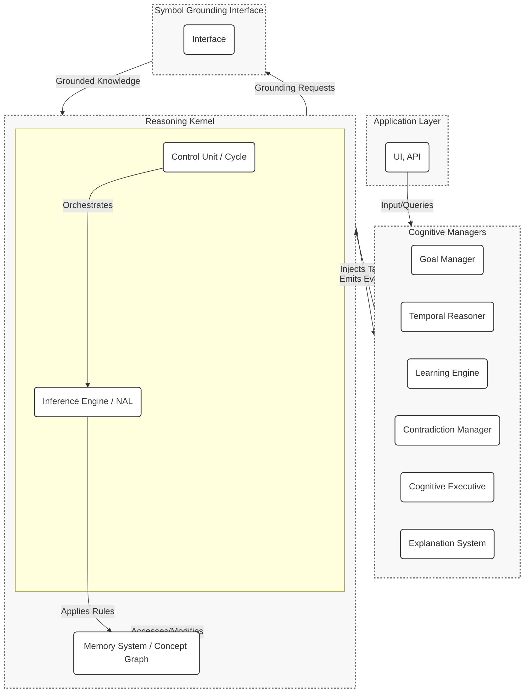

# HyperNARS New Implementation: DESIGN.md

This document provides the detailed technical blueprint for the new, clean-room reimplementation of the HyperNARS reasoning system.

## Table of Contents

1.  [System Architecture](#system-architecture)
2.  [Core Data Structures](#core-data-structures)
3.  [The Reasoning Cycle (Control Unit)](#the-reasoning-cycle-control-unit)
4.  [Inference Engine](#inference-engine)
5.  [Memory System](#memory-system)
6.  [I/O and Public API](#io-and-public-api)
7.  [Extension Points](#extension-points)

## 1. System Architecture

The new HyperNARS architecture will be designed as a modular, layered system. This approach enhances testability, extensibility, and maintainability. The design is inspired by the C4 model, focusing on components and their interactions.

The system is composed of a central **Reasoning Kernel** that executes the core reasoning cycle, and a suite of specialized **Cognitive Managers** that handle higher-level cognitive functions. This separation of concerns ensures the kernel remains lean and focused on pure NARS logic, while complex behaviors can be developed and tested independently in the managers.

Communication is primarily handled via an **asynchronous event bus**. The Reasoning Kernel emits events at key points in its cycle, and managers subscribe to these events to perform their functions. This ensures loose coupling and allows for flexible, emergent behavior. Managers can influence the kernel by injecting new tasks into its processing queue.

### Event-Based Communication
The Reasoning Kernel will emit events at key points in the reasoning cycle. Cognitive Managers subscribe to these events to perform their functions. Below are the core events and their data payloads:

-   **`task-selected`**: Fired when a task is chosen from a concept's task queue for processing.
    -   **Payload**: `{ task: Task }`
-   **`belief-updated`**: Fired when a belief's truth-value is updated after revision with another belief.
    -   **Payload**: `{ belief: Belief, oldTruth: TruthValue }`
-   **`belief-added`**: Fired when a new belief is added to a concept.
    -   **Payload**: `{ belief: Belief }`
-   **`contradiction-detected`**: Fired by the Memory System when a new task or belief directly contradicts an existing belief.
    -   **Payload**: `{ statement: Statement, belief1: Belief, belief2: Belief }`
-   **`concept-activated`**: Fired when a concept's activation level changes.
    -   **Payload**: `{ concept: Concept, activation: number }`
-   **`concept-created`**: Fired when a new concept is created in memory.
    -   **Payload**: `{ concept: Concept }`
-   **`system-idle`**: Fired when the reasoning cycle has no tasks to process.
    -   **Payload**: `{ idleDuration: number }` // duration in milliseconds

Managers can inject new tasks into the system via a dedicated `Kernel.addTask(task: Task): void` method. This is the primary mechanism for managers to influence the reasoning process.

### Component Diagram



### Cognitive Manager Roles

The Cognitive Managers are specialized, pluggable modules that handle complex, cross-cutting concerns. They operate by subscribing to events from the Reasoning Kernel and can inject new tasks back into the system to influence its behavior.

-   **Goal Manager**: Manages the system's goals.
    -   *Subscribes to*: `belief-updated`, `belief-added`.
    -   *Action*: When a belief indicates progress toward an active goal, the manager can increase the priority of related tasks. When a goal is satisfied, it may derive new goals.
    -   *Injects*: High-priority tasks aimed at satisfying goals (e.g., questions to acquire missing knowledge).

-   **Temporal Reasoner**: Provides a comprehensive framework for understanding and reasoning about time.
    -   *Subscribes to*: `belief-added`.
    -   *Action*: Analyzes beliefs with temporal information, using **Allen's Interval Algebra** to infer new temporal relationships (e.g., if A is before B and B is before C, it infers A is before C).
    -   *Injects*: New beliefs representing the inferred temporal relationships.

-   **Learning Engine**: Responsible for abstracting knowledge and forming new concepts.
    -   *Subscribes to*: `concept-created`, `belief-added`.
    -   *Action*: Detects patterns and correlations across concepts to form higher-level abstractions or new inference rules. For example, it might notice that `(<X> --> <Y>)` and `(<Y> --> <Z>)` frequently lead to `(<X> --> <Z>)` and propose a new compositional rule.
    -   *Injects*: Tasks representing new concepts or learned rules.

-   **Contradiction Manager**: Implements sophisticated strategies for resolving contradictions.
    -   *Subscribes to*: `contradiction-detected`.
    -   *Action*: When a contradiction is detected, this manager analyzes the evidence, source reliability, and recency of the conflicting beliefs to decide on a resolution strategy (e.g., merge, discard, specialize).
    -   *Injects*: Tasks that revise or remove beliefs to resolve the contradiction.

-   **Meta Reasoner (Cognitive Executive)**: Monitors and adapts the system's overall behavior.
    -   *Subscribes to*: `task-selected`, `system-idle`, `contradiction-detected`.
    -   *Action*: Tracks system metrics (e.g., inference rate, contradiction rate). If it detects anomalies (e.g., a sudden spike in contradictions), it can dynamically adjust system parameters.
    -   *Injects*: Control tasks or directly calls configuration methods on the kernel (e.g., to adjust budget allocation strategies).

-   **Explanation System**: Generates human-readable explanations for the system's conclusions.
    -   *Subscribes to*: `belief-updated`, `belief-added`.
    -   *Action*: Maintains a trace of derivations. When the public API's `explain()` method is called, this manager is queried to construct the explanation graph.
    -   *Injects*: Does not typically inject tasks; primarily responds to API requests.

-   **Test Generation Manager**: Proactively ensures the system's reasoning capabilities are robust by identifying and filling gaps in its test coverage.
    -   *Subscribes to*: `afterCycle`, `rule-utility-updated`.
    -   *Action*: Periodically analyzes metrics to find under-utilized inference rules or concepts with low activity. It then formulates premises that would specifically trigger these rules.
    -   *Injects*: Goals to execute under-tested components, logging the proposed test case for developer review. This is a key part of the system's "dogfooding" capability, allowing it to help improve its own quality.

-   **Codebase Integrity Manager**: A specialized manager for self-analysis, responsible for ingesting the system's own source code and design documents to reason about their structure and consistency.
    -   *Subscribes to*: This manager is typically triggered by a high-level goal, e.g., `goal: <(analyze, 'self.design')>`.
    -   *Action*: Uses grounded functions to parse source files (`.js`), design documents (`.md`), and test specifications. It creates NAL beliefs representing the system's architecture, code quality metrics (e.g., cyclomatic complexity), and test statuses. It then compares this knowledge against a set of baked-in consistency rules (e.g., from `AGENTS.md`).
    -   *Injects*: Goals to resolve detected inconsistencies between design and implementation, or to refactor code that violates quality guidelines. The output is a human-readable report or patch file.

## 2. Core Data Structures

The core data structures will be designed as **immutable** objects where possible to ensure functional purity, thread safety, and predictable state management.

```typescript
// A Term is the basic unit of meaning, representing an entity or concept.
// It can be an atomic identifier (string) or a CompoundTerm.
type Term = string | CompoundTerm;

// A CompoundTerm is a structure composed of other terms, connected by an operator.
// This allows for representing complex subjects/predicates, e.g., "all birds except penguins".
// Example: The term "(&, bird, (-, penguin))" in the statement "<(&, bird, (-, penguin)) --> flyer>"
interface CompoundTerm {
    readonly operator: 'conjunction' | 'negation' | 'set'; // and other potential operators
    readonly terms: Term[];
    // A unique, canonical string representation used for hashing.
    readonly key: string;
    toString(): string;
}

// A statement of a relationship between terms. It is the primary type of hyperedge in the Concept Hypergraph.
interface Statement {
    // A unique, canonical string representation of the statement, used for hashing.
    // The key MUST be generated consistently regardless of term order for symmetric statements.
    readonly key: string;
    // An array of terms involved in the statement, in a defined order.
    readonly terms: Term[];
    // The type of copula connecting the terms.
    readonly copula: 'inheritance' | 'similarity' | 'implication' | 'equivalence' | 'conjunction';
    // Returns a human-readable string, e.g., "(bird --> animal)".
    toString(): string;
}

// Example Implementation of Statement subtypes for clarity.
class InheritanceStatement implements Statement {
    readonly key: string;
    readonly terms: Term[];
    readonly copula = 'inheritance';
    constructor(subject: Term, predicate: Term) {
        this.terms = [subject, predicate];
        this.key = `(${subject} --> ${predicate})`;
    }
    toString = () => this.key;
}
class SimilarityStatement implements Statement {
    readonly key: string;
    readonly terms: Term[];
    readonly copula = 'similarity';
    constructor(term1: Term, term2: Term) {
        // Sort terms to ensure canonical key for symmetric relation
        const sortedTerms = [term1, term2].sort();
        this.terms = sortedTerms;
        this.key = `(${sortedTerms[0]} <-> ${sortedTerms[1]})`;
    }
    toString = () => this.key;
}
class ConjunctionStatement implements Statement {
    readonly key: string;
    readonly terms: Term[];
    readonly copula = 'conjunction';
    // Terms are sorted to ensure canonical representation, e.g., (&&, A, B) is same as (&&, B, A)
    constructor(terms: Term[]) {
        this.terms = terms.sort();
        this.key = `(&&, ${this.terms.join(', ')})`;
    }
    toString = () => this.key;
}


// Represents the epistemic value of a statement, grounded in evidence.
class TruthValue {
    readonly f: number; // frequency in [0, 1]
    readonly c: number; // confidence in (0, 1)
    readonly d: number; // doubt in [0, 1]

    constructor(f: number, c: number, d: number = 0) {
        this.f = Math.max(0, Math.min(1, f));
        this.c = Math.max(0, Math.min(1, c));
        this.d = Math.max(0, Math.min(1, d));
    }

    // Expectation: The degree of positive evidence, adjusted for doubt.
    get e(): number { return this.c * (this.f - 0.5) * (1 - this.d) + 0.5; }

    // NAL Revision: Combines two pieces of evidence.
    static revise(t1: TruthValue, t2: TruthValue): TruthValue {
        const f1 = t1.f, c1 = t1.c, d1 = t1.d;
        const f2 = t2.f, c2 = t2.c, d2 = t2.d;

        // The weights w1 and w2 represent the relative confidence of each piece of evidence.
        // A piece of evidence is weighted by its own confidence, discounted by the confidence of the other.
        const w1 = c1 * (1 - c2);
        const w2 = c2 * (1 - c1);
        const w_sum = w1 + w2;

        // If the sum of weights is zero, it implies both c1 and c2 are 1, which represents a logical contradiction.
        // In this case, the result is maximum doubt and zero confidence.
        if (w_sum === 0) return new TruthValue((f1+f2)/2, 0, 1); // Total contradiction

        // The revised frequency is the weighted average of the two frequencies.
        const f_rev = (f1 * w1 + f2 * w2) / w_sum;
        // The revised confidence is the sum of the weights divided by the sum of weights plus the product of ignorances.
        // This formula ensures that confidence grows with consistent evidence.
        const c_rev = w_sum / (w_sum + (1 - c1) * (1 - c2));

        // Doubt has two components: inherited doubt and conflict-generated doubt.
        // 1. Inherited doubt is merged: `1 - (1 - d1) * (1 - d2)`
        // 2. Conflict-generated doubt is proportional to the difference in frequencies.
        const d_conflict = Math.abs(f1 - f2) / 2;
        // The final doubt is the union of these two sources.
        const d_rev = 1 - (1 - d1) * (1 - d2) * (1 - d_conflict);

        return new TruthValue(f_rev, c_rev, d_rev);
    }

    // NAL Projection: Calculates truth for a component of a compound term.
    static project(t: TruthValue, numComponents: number): TruthValue {
        // According to NARS literature, projection primarily affects confidence.
        // The confidence of a projected belief is a function of the original confidence
        // and the size of the set from which it is projected.
        // c_proj = c / (1 + log2(k)) where k is numComponents.
        // This is a more theoretically grounded formula.
        const c_proj = t.c / (1 + Math.log2(numComponents));
        // Doubt is inherited directly from the parent. Projection reduces confidence because
        // it represents a loss of specificity, but it doesn't introduce new sources of
        // contradiction or ambiguity, so the original doubt level is maintained.
        return new TruthValue(t.f, c_proj, t.d);
    }

    // NAL Conjunction (Intersection): Combines two statements conjunctively.
    static and(t1: TruthValue, t2: TruthValue): TruthValue {
        const f = t1.f * t2.f;
        const c = t1.c * t2.c;
        // Doubt in a conjunction is the union of the doubt of its parts.
        const d = 1 - (1 - t1.d) * (1 - t2.d);
        return new TruthValue(f, c, d);
    }

    // NAL Union: Combines two statements disjunctively.
    static or(t1: TruthValue, t2: TruthValue): TruthValue {
        const f = 1 - (1 - t1.f) * (1 - t2.f);
        const c = t1.c * t2.c;
        // Doubt in a disjunction is the union of the doubt of its parts.
        const d = 1 - (1 - t1.d) * (1 - t2.d);
        return new TruthValue(f, c, d);
    }
}

// Represents the allocation of computational resources to a task.
class Budget {
    readonly priority: number;   // [0, 1]: How important is the task now?
    readonly durability: number; // [0, 1]: How important is the task over time?
    readonly quality: number;    // [0, 1]: How well-founded is the task?

    constructor(priority: number, durability: number, quality: number);

    /**
     * Dynamically allocates a budget for a new task using a configurable strategy.
     * @param context An object with factors like:
     *        - `type`: 'input', 'derived', 'goal'
     *        - `novelty`: How new is the information? [0, 1]
     *        - `urgency`: How time-sensitive is it? [0, 1]
     *        - `parentQuality`: Quality of the parent belief/task.
     *        - `ruleUtility`: The historical success rate of the deriving rule.
     * @param config The system's budget allocation configuration.
     */
    static dynamicAllocate(
        context: { type: string, novelty: number, urgency: number, parentQuality: number, ruleUtility?: number },
        config: BudgetAllocationConfig
    ): Budget {
        let priority = 0.5, durability = 0.5, quality = context.parentQuality;
        const utility = context.ruleUtility ?? 1.0;

        switch (context.type) {
            case 'input':
                priority = config.input.urgencyWeight * context.urgency + config.input.noveltyWeight * context.novelty;
                durability = config.input.durability;
                break;
            case 'goal':
                priority = config.goal.urgencyWeight * context.urgency;
                durability = config.goal.durability;
                break;
            case 'derived':
                priority = (config.derived.parentQualityWeight * context.parentQuality + config.derived.noveltyWeight * context.novelty) * utility;
                durability = (config.derived.parentQualityWeightForDurability * context.parentQuality) * utility;
                break;
        }
        return new Budget(priority, durability, quality);
    }

    /**
     * **Rationale for `dynamicAllocate`:**
     *
     * The `dynamicAllocate` function is designed to reflect the system's priorities based on the origin and nature of a task, in accordance with AIKR. The constants and weights are heuristics chosen to produce specific behaviors:
     *
     * -   **Input Tasks**: These are considered highly important and urgent as they represent new information from the external world. They receive a high `priority` (weighted towards `urgency`) to ensure they are processed quickly, but a moderate `durability` as their long-term importance is not yet known.
     * -   **Goal Tasks**: These are the system's objectives and are given the highest `priority` and `durability` to ensure persistent focus on achieving them.
     * -   **Derived Tasks**: The budget for these tasks is a function of the `parentQuality` (the confidence of the belief that generated them) and the historical `ruleUtility`. This crucial link ensures that the system allocates more resources to lines of reasoning that are well-founded and have proven effective in the past, while reducing focus on speculative or low-confidence derivations. The `novelty` factor provides a small boost to encourage exploration.
     */

    // Merges budgets from parent tasks.
    static merge(b1: Budget, b2: Budget): Budget {
        // A more sophisticated merging strategy that prevents the system from getting
        // stuck in low-quality reasoning loops. Priority and Durability are averaged,
        // but the new quality is the product of the parent qualities, reflecting that
        // a conclusion is only as strong as its weakest link.
        const priority = (b1.priority + b2.priority) / 2;
        const durability = (b1.durability + b2.durability) / 2;
        const quality = b1.quality * b2.quality;
        return new Budget(priority, durability, quality);
    }
}

// An immutable pairing of a Statement and its epistemic value.
interface Belief {
    readonly statement: Statement;
    readonly truth: TruthValue;
    readonly timestamp: number; // Creation time for temporal analysis.
}

// A work unit for the system, containing a statement to be processed.
interface Task {
    readonly statement: Statement;
    readonly budget: Budget;
    readonly parentBeliefs: Belief[]; // Provenance/derivation history.
    readonly stamp: Stamp; // Derivational stamp to prevent infinite loops.
}

### 2.1. The Derivational Stamp

To prevent infinite reasoning loops (e.g., A -> B, B -> A) and redundant derivations, each `Task` carries a `Stamp`. The stamp records the IDs of the parent beliefs and tasks that contributed to its creation. Before an inference rule is applied, the system checks if the stamps of the two premises (the task and the belief) overlap. If they do, the inference is blocked, as it would mean re-deriving information from its own lineage.

Two primary implementations of the `Stamp` can be considered:

1.  **Evidential Base (OpenNARS-style):**
    -   **Representation**: The stamp is an array of unique integer IDs, where each ID corresponds to an input belief or a specific derivation step.
    -   **Merge Operation**: When two tasks/beliefs are merged, their stamp arrays are concatenated, and the resulting list is sorted and deduplicated.
    -   **Overlap Check**: Overlap is detected by performing a linear scan or a more optimized intersection check on the two sorted arrays.
    -   **Pros**: Guarantees perfect loop detection. The full derivation path is preserved.
    -   **Cons**: Can become very large for long derivation chains, consuming significant memory and making the overlap check computationally expensive.

2.  **Bloom Filter / Bitwise Representation:**
    -   **Representation**: The stamp is a bitmask or a Bloom filter, a fixed-size probabilistic data structure. Each belief ID is hashed to one or more bit positions in the filter, which are then set to `1`.
    -   **Merge Operation**: Merging two stamps is a simple, fast bitwise `OR` operation on their filters. `new_filter = filter1 | filter2`.
    -   **Overlap Check**: Overlap is checked with a bitwise `AND` operation. If `(filter1 & filter2) !== 0`, there is a potential overlap.
    -   **Pros**: Extremely fast and memory-efficient due to its fixed size.
    -   **Cons**: Probabilistic. It can produce false positives (reporting an overlap where none exists), which would incorrectly block a valid inference path. The rate of false positives can be tuned by adjusting the size of the filter and the number of hash functions, but it can never be zero. It does not preserve the full derivation path.

The choice between these two represents a classic trade-off between logical perfection and resource efficiency, a core theme in NARS. The system could even be configured to use one or the other based on the desired operational profile.

// A node in the memory graph, representing a single Term.
class Concept {
    readonly term: Term;
    // All beliefs directly related to this concept, indexed by statement key.
    readonly beliefs: Map<string, Belief>;
    // A queue of tasks to be processed, prioritized by budget.
    readonly taskQueue: PriorityQueue<Task>;
    // The current activation level of the concept.
    activation: number;
    // Max number of beliefs/tasks to store. Can be dynamic.
    capacity: number;

    /**
     * A helper function to determine if two truth values are contradictory.
     * This is based on a configurable threshold.
     * @param t1 The first truth value.
     * @param t2 The second truth value.
     * @param threshold The minimum confidence for both beliefs to be considered for contradiction.
     * @returns True if they are contradictory, false otherwise.
     */
    isContradictory(t1: TruthValue, t2: TruthValue, threshold: number = 0.51): boolean {
        // Contradictory if they are on opposite sides of the 0.5 frequency mark
        // and both have a confidence greater than the threshold.
        const oppositeFrequency = (t1.f > 0.5 && t2.f < 0.5) || (t1.f < 0.5 && t2.f > 0.5);
        const sufficientConfidence = t1.c > threshold && t2.c > threshold;
        return oppositeFrequency && sufficientConfidence;
    }

    // Adds a new belief, revising if a related one exists.
    addBelief(belief: Belief): void {
        const key = belief.statement.key;
        if (this.beliefs.has(key)) {
            const existingBelief = this.beliefs.get(key)!;
            // Check for contradiction before revising
            if (this.isContradictory(belief.truth, existingBelief.truth)) {
                kernel.events.emit('contradiction-detected', {
                    statement: belief.statement,
                    belief1: existingBelief,
                    belief2: belief
                });
                return; // The Contradiction Manager will handle resolution.
            }
            // Revise with existing belief
            const newTruth = TruthValue.revise(existingBelief.truth, belief.truth);
            const newBelief = { ...existingBelief, truth: newTruth, timestamp: Date.now() };
            this.beliefs.set(key, newBelief);
            kernel.events.emit('belief-updated', { belief: newBelief, oldTruth: existingBelief.truth });
        } else {
            // Add new belief, forgetting if at capacity
            if (this.beliefs.size >= this.capacity) {
                this.forget(this.beliefs);
            }
            this.beliefs.set(key, belief);
            kernel.events.emit('belief-added', { belief });
        }
    }

    // Adds a task to the priority queue.
    addTask(task: Task): void {
        if (this.taskQueue.length >= this.capacity) {
            this.forget(this.taskQueue);
        }
        this.taskQueue.enqueue(task, task.budget.priority);
    }

    // Selects the highest-priority task from the queue.
    selectTask(): Task | null {
        return this.taskQueue.dequeue();
    }

    // Internal forgetting mechanism for a given collection (beliefs or tasks).
    private forget(collection: Map<string, Belief> | PriorityQueue<Task>): void {
        let lowestRelevance = Infinity;
        let keyToForget: string | null = null;

        if (collection instanceof Map) { // Forgetting a belief from the beliefs Map
            for (const [key, belief] of collection.entries()) {
                // Relevance for beliefs = confidence * activation
                const relevance = belief.truth.c * this.activation;
                if (relevance < lowestRelevance) {
                    lowestRelevance = relevance;
                    keyToForget = key;
                }
            }
            if (keyToForget) {
                collection.delete(keyToForget);
            }
        } else { // Forgetting a task from the taskQueue (PriorityQueue)
            // This is conceptually simple but can be inefficient. A practical implementation
            // might use a data structure that allows for efficient removal of low-priority items.
            // For this blueprint, we describe the logic.
            const tempArray = collection.toArray(); // Assume PriorityQueue can be exported to an array
            if (tempArray.length === 0) return;

            let itemToForget: Task | null = null;
            tempArray.forEach(task => {
                // Relevance for tasks = priority * activation
                const relevance = task.budget.priority * this.activation;
                if (relevance < lowestRelevance) {
                    lowestRelevance = relevance;
                    itemToForget = task;
                }
            });

            // Reconstruct the queue without the forgotten item
            collection.clear(); // Assume clear() method
            tempArray.forEach(task => {
                if (task !== itemToForget) {
                    collection.enqueue(task, task.budget.priority);
                }
            });
        }
    }
}
```

## 3. The Reasoning Cycle: A Dual-Process Control Unit

To achieve a balance between efficiency and thoroughness, the reasoning cycle is architected as a **dual-process system**, inspired by dual process theories in cognitive science. This allows the system to handle routine inferences rapidly while dedicating more resources to complex, novel, or problematic situations. The two modes are:

1.  **System 1 (Reflexive Mode):** A fast, associative, and resource-efficient mode for routine reasoning. It operates continuously, handling the vast majority of inferences.
2.  **System 2 (Deliberative Mode):** A slow, serial, and resource-intensive mode for deep, focused reasoning. It is triggered under specific conditions to handle complex problems, paradoxes, or high-stakes goals.

The **Cognitive Executive** (the `MetaReasoner` manager) is responsible for monitoring the system's state and orchestrating the transition between these two modes.

### 3.1. System 1: The Reflexive Reasoning Loop

This is the default operational mode, representing the main loop of the system. It is designed for high throughput and continuous, parallelizable processing. Its operation is largely unchanged from a standard NARS control cycle.

```pseudocode
function reflexiveReasoningCycle(kernel) {
  while (kernel.isRunning && kernel.getMode() === 'reflexive') {
    // A mutable context object for this cycle, passed to hooks.
    let cycleContext = { kernel, task: null, concept: null, belief: null, derivedTasks: [] };

    // HOOK: beforeCycle (read-only context)
    kernel.hooks.run('beforeCycle', cycleContext);

    // 1. Select a Concept and a Task from memory.
    let { concept, task } = kernel.memory.selectTaskFromOverallExperience();
    if (!task || !concept) {
        kernel.events.emit('system-idle', { idleDuration: 100 });
        kernel.wait(100); // Wait if no task is available.
        continue;
    }
    cycleContext.task = task;
    cycleContext.concept = concept;
    kernel.events.emit('task-selected', { task });

    // 2. Select a Belief from the chosen Concept to interact with the Task.
    let belief = concept.selectBeliefForTask(task);
    if (!belief) continue; // No relevant belief found.
    cycleContext.belief = belief;

    // 3. Perform Local Inference.
    let derivedTasks = kernel.inferenceEngine.applyAllRules(cycleContext.task, cycleContext.belief);
    cycleContext.derivedTasks = derivedTasks;

    // 4. Process and Store Derived Tasks.
    for (let derivedTask of cycleContext.derivedTasks) {
      let targetConcept = kernel.memory.getOrCreateConcept(derivedTask.statement.terms[0]);
      targetConcept.addTask(derivedTask);
    }

    // 5. System-level cleanup and updates.
    kernel.hooks.run('afterCycle', cycleContext);
  }
}
```

### 3.2. System 2: The Deliberative Reasoning Process

The Deliberative Mode is not a simple loop but a structured, goal-driven process initiated by the Cognitive Executive when it detects a situation requiring deeper analysis. This mode consumes a significantly larger budget and may temporarily halt the Reflexive Mode to focus resources.

**Triggers for Deliberative Mode:**

The Cognitive Executive transitions the system to Deliberative Mode upon detecting:
-   **High-Impact Contradictions:** A contradiction between two high-confidence beliefs, or a contradiction related to a high-priority goal.
-   **Persistent Paradoxes:** Detection of logical or temporal paradoxes (e.g., the Liar Paradox, or `A before B` and `B before A`). This is key to addressing the `temporal_paradox.js` test failure.
-   **Strategic Goal Pursuit:** A high-priority goal that requires complex planning, simulation, or means-ends analysis.
-   **Explicit Metacognitive Command:** An input task instructing the system to "think about" a specific concept or problem.

**The Deliberative Process:**

Once triggered, the Deliberative Mode executes a multi-step analysis:
1.  **Context Freezing & Scoping:** The relevant area of the concept graph is "frozen" by allocating a large budget to the involved concepts and tasks, preventing them from being forgotten during the analysis.
2.  **Hypothesis Generation:** Instead of just applying rules forward, the system generates multiple competing hypotheses. For a paradox, it might generate hypotheses like "premise A is wrong," "premise B is wrong," or "the derivation rule is misapplied."
3.  **Evidence Gathering & Simulation:** The system actively seeks evidence for or against each hypothesis. This may involve generating questions (`nalq`) to find missing information or running "mental simulations" by exploring long derivation chains without immediately adding the results to the belief space.
4.  **Conclusion & Action:** After a set number of steps or when a conclusion reaches a high confidence threshold, the system commits to a resolution. This might involve:
    -   Revising a core belief that caused the paradox.
    -   Creating a new, more nuanced belief that resolves a contradiction (e.g., via the Specialize strategy).
    -   Adjusting the utility of an inference rule that consistently leads to errors.
    -   Formulating a multi-step plan to achieve a complex goal.
5.  **Return to Reflexive Mode:** The Cognitive Executive then transitions the system back to System 1, possibly with new knowledge or goals derived from the deliberative process.

This dual-process architecture provides a more robust framework for handling the kinds of complex issues identified in the skipped tests, offering a clear path to fixing "deeper bugs" in the reasoning engine.

### 3.3. Task and Belief Selection Algorithms

The functions `selectTaskFromOverallExperience()` and `selectBeliefForTask()` are critical for guiding the system's attention.

**`selectTaskFromOverallExperience()`**

This function implements a two-level selection process to balance global priorities with local context.

1.  **Concept Selection**: First, a concept is chosen from the entire memory. This is not a uniform random selection. Instead, it's a weighted "roulette-wheel" selection where each concept's chance of being chosen is proportional to its activation level. This ensures that more active, currently relevant concepts are processed more frequently.
2.  **Task Selection**: Once a concept is selected, the highest-priority task is dequeued from its `taskQueue`.

```pseudocode
function selectTaskFromOverallExperience(memory) {
    // 1. Select a concept using a roulette-wheel method based on activation.
    let totalActivation = memory.concepts.sum(c => c.activation);
    let randomPoint = Math.random() * totalActivation;
    let currentSum = 0;
    let selectedConcept = null;
    for (let concept of memory.concepts) {
        currentSum += concept.activation;
        if (currentSum >= randomPoint) {
            selectedConcept = concept;
            break;
        }
    }

    if (!selectedConcept) return { concept: null, task: null };

    // 2. Select the best task from that concept's queue.
    let task = selectedConcept.selectTask();
    return { concept: selectedConcept, task: task };
}
```

**`selectBeliefForTask(task)`**

Given a task, the concept must select a relevant belief to interact with. Relevance is key to fostering meaningful inferences.

1.  **Candidate Selection**: Identify all beliefs in the concept that are "structurally relevant" to the task. This means they share at least one common term.
2.  **Relevance Scoring**: Score each candidate belief. A simple relevance score can be `belief.truth.confidence * structural_similarity_score`. A more advanced score could consider recency or other factors.
3.  **Best Belief Selection**: Select the belief with the highest relevance score.

```pseudocode
function selectBeliefForTask(concept, task) {
    let bestBelief = null;
    let maxRelevance = -1;

    for (let belief of concept.beliefs.values()) {
        if (hasCommonTerms(task.statement, belief.statement)) {
            // Calculate relevance (simple version: use confidence)
            let relevance = belief.truth.confidence;
            if (relevance > maxRelevance) {
                maxRelevance = relevance;
                bestBelief = belief;
            }
        }
    }
    return bestBelief;
}
```

## 4. Inference Engine

The Inference Engine is a stateless, extensible component responsible for applying Non-Axiomatic Logic (NAL) rules to derive new knowledge from existing beliefs.

### Core Principles
-   **Extensible Rule System**: The engine will use a central registry, `Map<string, InferenceRule>`, where new rules can be added at runtime via `kernel.inferenceEngine.registerRule(rule)`. This allows for the system's reasoning capabilities to be expanded or modified.
-   **Self-Optimizing Rule Application**: To manage resource allocation under AIKR, a rule's utility is a value `U in [0, 1]` that is updated over time. When a rule derives a new task, the task's budget is modulated by the rule's utility.
    -   **Utility Update**: A rule's utility `U` can be updated based on the feedback from the tasks it generates. For example, if a derived belief is later revised and its confidence increases significantly, the utility of the rule that created it could be reinforced. `U_new = U_old * (1 - alpha) + feedback * alpha`, where `alpha` is a learning rate and `feedback` is a measure of the derived task's success (e.g., the quality of the resulting belief).
    -   **Budget Modulation**: The budget for a derived task is calculated as `Budget_derived = f(Budget_parent1, Budget_parent2) * U_rule`. This prioritizes rules that have proven more effective in the current context.

### Inference Rule Categories
The engine will support a comprehensive set of NAL rules, including but not limited to:

-   **Syllogistic & Conditional Rules (NAL Levels 1-5)**:
    -   **Deduction**: `(<M --> P>., <S --> M>.) |- <S --> P>.`
    -   **Abduction**: `(<P --> M>., <S --> M>.) |- <S --> P>.` (inference to the best explanation)
    -   **Induction**: `(<M --> P>., <M --> S>.) |- <S --> P>.` (generalization)
    -   **Exemplification**: The inverse of induction.
    -   **Comparison**: `(<M --> P>., <M <-> S>.) |- <S --> P>.`
    -   **Analogy**: `(<M --> P>., <S <-> M>.) |- <S --> P>.` (a form of abduction and induction)
-   **Compositional/Structural Rules (NAL Level 6)**:
    -   **Intersection**: `(<S --> M1>., <S --> M2>.) |- <S --> (&&, M1, M2)>.`
    -   **Union**: The inverse of intersection.
-   **Temporal Rules (NAL Level 7)**: Primarily handled by the `TemporalReasoner` manager, which can inject inferred temporal statements back into the kernel.
-   **Procedural & Operational Rules (NAL Levels 8-9)**: For learning and executing skills, managed by specialized cognitive managers.

### Inference Rule Interface & Example

All rules must implement the `InferenceRule` interface.

```typescript
interface InferenceRule {
  // A unique name for the rule (e.g., "NAL_DEDUCTION_FORWARD")
  readonly name: string;
  // The historical utility of the rule, used for budget allocation.
  utility: number;

  // Checks if the rule can be applied to the given premises.
  // This involves checking statement structure and term matching.
  canApply(task: Task, belief: Belief): boolean;

  // Applies the rule and returns a new derived Task, or null if not applicable.
  // It requires access to the kernel to retrieve configuration.
  apply(task: Task, belief: Belief, kernel: any /* Kernel */): Task | null;
}
```

#### Example: The Deduction Rule

The deduction rule is one of the most fundamental inference rules.

-   **Logical Form**: `(M --> P), (S --> M) |- (S --> P)`
-   **Premises**:
    1.  A task `T1` with statement `(M --> P)`.
    2.  A belief `B1` with statement `(S --> M)`.
-   **Conclusion**: A new task `T2` with statement `(S --> P)`.

-   **Truth-Value Function**:
    -   `f_conclusion = f_premise1 * f_premise2`
    -   `c_conclusion = c_premise1 * c_premise2 * f_premise1`
-   **Budget Function**:
    -   `priority = (p1 + p2) / 2 * 0.9` (slightly lower than parents)
    -   `durability = (d1 + d2) / 2 * 0.9`
    -   `quality = q1 * q2`

```typescript
class DeductionRule implements InferenceRule {
    readonly name = "NAL_DEDUCTION_FORWARD";
    utility = 1.0;

    canApply(task: Task, belief: Belief): boolean {
        const s1 = task.statement;
        const s2 = belief.statement;
        // Check if both are inheritance statements and the terms match the pattern M->P, S->M
        return s1.copula === 'inheritance' &&
               s2.copula === 'inheritance' &&
               s1.terms[0] === s2.terms[1]; // M matches
    }

    apply(task: Task, belief: Belief, kernel: any /* Kernel */): Task | null {
        if (!this.canApply(task, belief)) return null;

        const s1 = task.statement; // (M --> P)
        const s2 = belief.statement; // (S --> M)

        // 1. Create the new statement: (S --> P)
        const derivedStatement = new InheritanceStatement(s2.terms[0], s1.terms[1]);

        // 2. Calculate the new truth value
        const t1 = task.parentBeliefs[0].truth; // Assuming task has truth from a parent
        const t2 = belief.truth;
        const f_new = t1.f * t2.f;
        const c_new = t1.c * t2.c * t1.f; // Asymmetric confidence calculation
        const derivedTruth = new TruthValue(f_new, c_new);

        // 3. Calculate the new budget
        const b1 = task.budget;
        // The quality of the new task is based on the quality of the parent task
        // and the confidence of the parent belief.
        const quality_new = b1.quality * t2.c;

        // The priority and durability are derived from the parent task, modulated by
        // the confidence of the belief, as interacting with a high-confidence belief
        // should yield a higher-priority task.
        const urgency = b1.priority * t2.c;

        // Novelty is calculated by checking if a similar belief already exists in the target concept.
        // The more confident the existing belief, the less novel the derived task is considered.
        // This logic assumes the inference engine can query the memory system.
        const targetConcept = kernel.memory.getOrCreateConcept(derivedStatement.terms[0]);
        const existingBelief = targetConcept.beliefs.get(derivedStatement.key);
        const novelty = existingBelief
            ? 1 - existingBelief.truth.c
            : 1.0;

        const derivedBudget = Budget.dynamicAllocate({
            type: 'derived',
            novelty: novelty,
            urgency: urgency,
            parentQuality: quality_new,
            ruleUtility: this.utility
        }, kernel.config.BUDGET_ALLOCATION_CONFIG);

        // 4. Create and return the new task
        const derivedTask: Task = {
            statement: derivedStatement,
            truth: derivedTruth,
            budget: derivedBudget,
            parentBeliefs: [task.parentBeliefs[0], belief]
        };

        return derivedTask;
    }
}
```

#### Example: The Abduction Rule

Abduction, or "inference to the best explanation," is a powerful rule for generating hypotheses.

-   **Logical Form**: `(P --> M), (S --> M) |- (S --> P)` (Note the shared predicate `M`)
-   **Premises**:
    1.  A task `T1` with statement `(P --> M)` (e.g., "ravens are black").
    2.  A belief `B1` with statement `(S --> M)` (e.g., "my pet is black").
-   **Conclusion**: A new task `T2` with statement `(S --> P)` (e.g., hypothesizing "my pet is a raven").

-   **Truth-Value Function**: Abduction produces a weaker conclusion than deduction.
    -   `f_conclusion = f_premise1`
    -   `c_conclusion = c_premise1 * c_premise2 * f_premise2` (Simplified formula)
-   **Budget Function**: The budget for an abductive task should reflect its hypothetical nature, meaning its quality is highly dependent on the confidence of the premises.

```typescript
class AbductionRule implements InferenceRule {
    readonly name = "NAL_ABDUCTION";
    utility = 1.0;

    canApply(task: Task, belief: Belief): boolean {
        const s1 = task.statement;
        const s2 = belief.statement;
        // Check if both are inheritance statements and the predicates match: P->M, S->M
        return s1.copula === 'inheritance' &&
               s2.copula === 'inheritance' &&
               s1.terms[1] === s2.terms[1]; // M matches
    }

    apply(task: Task, belief: Belief, kernel: any /* Kernel */): Task | null {
        if (!this.canApply(task, belief)) return null;

        const s1 = task.statement; // <P --> M>
        const s2 = belief.statement; // <S --> M>

        // 1. Create the new statement: <S --> P>
        const derivedStatement = new InheritanceStatement(s2.terms[0], s1.terms[0]);

        // 2. Calculate the new truth value (abduction)
        // The conclusion <S --> P> is a hypothesis. Its frequency is inherited from the major
        // premise <P --> M>. Its confidence is a product of the parent confidences, further
        // weighted by the frequency of the minor premise <S --> M>, which represents the
        // evidential support for the hypothesis.
        const t1 = task.parentBeliefs[0].truth;
        const t2 = belief.truth;
        const f_new = t1.f;
        const c_new = t1.c * t2.c * t2.f;
        const derivedTruth = new TruthValue(f_new, c_new);

        // 3. Calculate the new budget
        const quality_new = task.budget.quality * belief.truth.c * t1.c;
        const derivedBudget = Budget.dynamicAllocate({
            type: 'derived',
            novelty: 0.9, // Abduction often creates highly novel hypotheses
            urgency: (task.budget.priority) / 3, // Lower urgency due to hypothetical nature
            parentQuality: quality_new,
            ruleUtility: this.utility
        }, kernel.config.BUDGET_ALLOCATION_CONFIG);

        // 4. Create and return the new task
        const derivedTask: Task = {
            statement: derivedStatement,
            budget: derivedBudget,
            parentBeliefs: [task.parentBeliefs[0], belief]
        };
        return derivedTask;
    }
}
```

#### Example: The Induction Rule

Induction generalizes from specific evidence.

-   **Logical Form**: `(M --> P), (M --> S) |- (S --> P)`
-   **Premises**:
    1.  A task `T1` with statement `(M --> P)`.
    2.  A belief `B1` with statement `(M --> S)`.
-   **Conclusion**: A new task `T2` with statement `(S --> P)`.

-   **Truth-Value Function**:
    -   `f_conclusion = f_premise2` (The evidence for the predicate)
    -   `c_conclusion = c_premise1 * c_premise2 * (f_premise1 / (f_premise1 * c_premise1 + (1-f_premise1)*c_premise1))`
    -   This is a simplified version of the full induction formula, which is more complex. The confidence depends on the amount of evidence supporting the premise.

```typescript
class InductionRule implements InferenceRule {
    readonly name = "NAL_INDUCTION";
    utility = 1.0;

    canApply(task: Task, belief: Belief): boolean {
        const s1 = task.statement;
        const s2 = belief.statement;
        // Check if both are inheritance statements and the subjects match: M->P, M->S
        return s1.copula === 'inheritance' &&
               s2.copula === 'inheritance' &&
               s1.terms[0] === s2.terms[0]; // M matches
    }

    apply(task: Task, belief: Belief, kernel: any /* Kernel */): Task | null {
        if (!this.canApply(task, belief)) return null;

        const s1 = task.statement; // <M --> P>
        const s2 = belief.statement; // <M --> S>

        // 1. Create the new statement: <S --> P>
        const derivedStatement = new InheritanceStatement(s2.terms[1], s1.terms[1]);

        // 2. Calculate the new truth value (induction)
        // The frequency is inherited from the second premise, as it provides the evidence for the
        // relationship between the new subject and the shared term. The confidence is more complex.
        // It is proportional to the evidence for the predicate (M->P) and the evidence for the
        // subject's relation to the evidence (M->S). The full NAL formula is complex, involving
        // the total evidence for M. This is a standard, effective approximation.
        const t1 = task.parentBeliefs[0].truth; // M -> P
        const t2 = belief.truth;               // M -> S
        const f_new = t2.f;
        const c_new = t1.c * t2.c * t1.f;
        const derivedTruth = new TruthValue(f_new, c_new);

        // 3. Calculate the new budget
        const quality_new = task.budget.quality * belief.truth.c;
        const derivedBudget = Budget.dynamicAllocate({
            type: 'derived',
            novelty: 0.8, // Induction often creates novel hypotheses
            urgency: (task.budget.priority) / 2,
            parentQuality: quality_new,
            ruleUtility: this.utility
        }, kernel.config.BUDGET_ALLOCATION_CONFIG);

        // 4. Create and return the new task
        const derivedTask: Task = {
            statement: derivedStatement,
            budget: derivedBudget,
            parentBeliefs: [task.parentBeliefs[0], belief]
        };
        return derivedTask;
    }
}
```

## 5. Memory System

The Memory System is the core of the system's knowledge base, structured as a dynamic concept graph and managed by several competing algorithms to adhere to AIKR.

-   **Concept Hypergraph**: The memory is structured as a **hypergraph**, a generalization of a graph in which an edge can join any number of vertices.
    -   **Vertices**: The vertices of the hypergraph are the `Concept` objects, each representing a unique `Term`.
    -   **Hyperedges**: The hyperedges are the `Statement` objects. A `Statement` represents a relationship that can connect two or more `Concepts`. While a standard inheritance statement like `<bird --> animal>` can be seen as a simple edge, the hypergraph model becomes essential for representing more complex, compositional knowledge. For example, a statement like `<(&&, mammal, has_wings) --> bat>` is a single hyperedge that connects three distinct concepts (`mammal`, `has_wings`, `bat`).
    -   This structure is "implicit" because the hyperedges (statements/beliefs) are stored within the `Concept` objects they are connected to, rather than in a separate, global edge list. This maintains the principle of locality. Concepts are stored in a central hash map, indexed by their `Term` for O(1) average-time lookup.

    **Hypergraph Visualization:**
    The following diagram illustrates how a complex belief is represented as a single hyperedge connecting multiple concepts. The central diamond represents the hyperedge for the statement `(<(&&, mammal, has_wings) --> bat>)`.

    ```mermaid
    graph TD
        subgraph "Concept Hypergraph Example"
            A("Concept: mammal")
            B("Concept: has_wings")
            C("Concept: bat")

            Hyperedge{ }

            A -- "antecedent" --> Hyperedge
            B -- "antecedent" --> Hyperedge
            Hyperedge -- "consequent" --> C

            subgraph Legend
                direction LR
                L1("Concept")
                L2{ }
                L1---L2("Hyperedge (Statement)")
            end
        end

        style Hyperedge fill:#ccf,stroke:#333,stroke-width:2px,rx:5px,ry:5px
        style L2 fill:#ccf,stroke:#333,stroke-width:2px,rx:5px,ry:5px
    ```

-   **Activation Spreading**: This is the mechanism for managing the system's focus of attention. When a concept is accessed, a portion of its activation energy is spread to related concepts.
    -   `Activation_new(C) = Activation_old(C) * (1 - decay_rate) + Sum(Activation_in(S, C))`
    -   `Activation_in(S, C)` is the activation transferred from a source concept `S` to target `C`. This is calculated as: `Activation_in = task.budget.priority * belief.truth.confidence * relevance_factor`, where `relevance_factor` can be a constant or a function of the type of connection. The activation is then distributed among all connected concepts.
    -   `decay_rate` is a system parameter that determines how quickly concepts lose activation over time.

-   **Forgetting Algorithm**: To manage finite memory resources, the system must forget less important information. This is a continuous, gentle process rather than a periodic "garbage collection" sweep.
    -   **Relevance Metric**: The importance of any item (a `Belief` or `Task`) within a concept is its `Relevance`. The calculation depends on the item type, combining the item's intrinsic importance with the concept's current activation:
        -   For a `Belief`: `Relevance = belief.truth.confidence * concept.activation`. This prioritizes retaining high-confidence knowledge in active concepts.
        -   For a `Task`: `Relevance = task.budget.priority * concept.activation`. This prioritizes processing high-priority tasks in active concepts.
    -   **Forgetting Process**: When a new item is added to a concept and its capacity is exceeded, the item with the lowest `Relevance` score is removed. The capacity can be dynamic, potentially growing as a concept becomes more frequently used (e.g., `capacity = base_capacity + log(concept.usage_count)`).

-   **Contradiction Handling**: This is managed by the `ContradictionManager` and is a sophisticated, multi-stage process. When a `contradiction-detected` event is fired, the manager executes the following logic:

    -   **1. Detection**: A contradiction is detected when a new belief `B1` is processed that has the same statement as an existing belief `B2` but a sufficiently different truth-value (e.g., one is positive evidence, the other is negative).

    -   **2. Evidence-Based Analysis**: The manager calculates an `evidenceStrength` for each conflicting belief, synthesizing factors like `truth.confidence`, `truth.recency`, and the reliability of the information source (if available).

    -   **3. Strategy Selection & Resolution**: Based on the analysis, a strategy is chosen. This is a rule-based decision process:
        -   **IF** `strength(B1) >> strength(B2)` **THEN** apply **DominantEvidence**: The weaker belief `B2` is removed. The budget of `B1` is boosted.
        -   **IF** `strength(B1) ~= strength(B2)` **THEN** apply **Merge**: The truth values of `B1` and `B2` are revised together using `TruthValue.revise()`. The resulting belief replaces the old one. The doubt (`d`) component of the new truth value will naturally increase, indicating uncertainty.
        -   **IF** `B1` is a general statement (e.g., `<bird --> flyer>`) and `B2` represents a conflicting special case (e.g., a high-confidence belief `<penguin --> not_a_flyer>` derived from input, where the system also knows `<penguin --> bird>`), **THEN** apply **Specialize**. This is a multi-step process for learning exceptions, which can be visualized as follows:

            ```mermaid
            graph TD
                subgraph "Initial State"
                    B_Gen("Belief: <bird --> flyer> (High Conf)")
                    B_Spec("Belief: <penguin --> bird> (High Conf)")
                    B_Ex("Input: <penguin --> not_a_flyer> (Very High Conf)")
                end

                subgraph "Reasoning Process"
                    B_Gen -- "Derives" --> D1("<penguin --> flyer>")
                    D1 -- "Contradicts" --> B_Ex
                end

                subgraph "Resolution: Specialize Strategy"
                    style R1 fill:#fdd
                    style R2 fill:#dfd
                    style R3 fill:#dfd
                    R1("1. Revise <bird --> flyer> with counter-evidence, lowering its confidence")
                    R2("2. Preserve specific knowledge <penguin --> not_a_flyer>")
                    R3("3. Create new, more precise belief <(&, bird, (-, penguin)) --> flyer>")
                end

                B_Ex -- "Triggers" --> R1
                B_Ex -- "Leads to" --> R2
                B_Gen -- "Is refined into" --> R3

            ```
            This strategy involves the following steps:
            1.  **Reduce Confidence of General Rule**: The system first reduces the confidence of the general belief `<bird --> flyer>`. It is not wrong, just incomplete. This is done by revising it with the conflicting evidence, which will naturally lower its confidence and increase its doubt.
            2.  **Identify the Exception**: The system identifies `penguin` as the term representing the exception, based on the high-confidence conflicting evidence.
            3.  **Construct Compound Term**: A new, more specific subject term is constructed to explicitly exclude the exception. This term is `(&, bird, (-, penguin))`, which represents "a bird that is not a penguin". This requires the system's `Term` logic to support conjunction (`&`) and negation (`-`).
            4.  **Inject New Learning Task**: The system injects a new, high-priority task into the reasoning cycle. The goal of this task is to form the new, more accurate belief: `(<(&, bird, (-, penguin)) --> flyer>)`. This task is derived from the original `<bird --> flyer>` belief but is now conditioned on the more specific, non-exceptional term.
            5.  **Preserve Specific Knowledge**: The specific, high-confidence belief `<penguin --> not_a_flyer>` is preserved as it is considered more specific and therefore more likely to be correct in its narrow context.
            This strategy allows the system to gracefully handle exceptions without discarding useful general knowledge, leading to a more nuanced and accurate belief system.
        -   **IF** `source(B1)` is more reliable than `source(B2)` **THEN** apply **SourceReliability**: Give precedence to `B1`, but do not necessarily discard `B2`. Instead, significantly lower the budget of `B2`.
        -   **IF** strategies above are inconclusive, **THEN** apply **RecencyBiased**: Give a slight budget advantage to the more recent belief.

    This entire process is designed to be extensible, allowing new resolution strategies to be added as plugins to the `ContradictionManager`.

## 6. I/O and Public API

The public API will be designed to be clean, language-agnostic, and powerful. It will be event-driven and asynchronous.

-   **Input/Output API**:
    -   `nal(statement: string, options?: object): Promise<InputResult>`: Asynchronously inputs a NAL statement. When `nal()` is called, the system performs a critical two-step process to ensure proper provenance for new information. First, it creates a `Belief` from the input `statement`, assigning it a high-confidence `TruthValue` and a `Budget` based on the system's `DEFAULT_INPUT_BUDGET` settings. Second, it creates the main `Task` to be processed. The `parentBeliefs` array of this new task is initialized with the belief created in the first step. This mechanism ensures that all tasks, whether derived internally or received from an external source, have a clear evidence trail, which is essential for the inference and revision processes.
    -   `nalq(question: string, options?: object): Promise<Answer>`: Asks a NAL question.
    -   `on(event: 'answer' | 'contradiction' | 'goal-achieved', callback: (data: object) => void): void`: Subscribes to system events.
-   **Control & Configuration API**:
    -   `run(steps?: number): Promise<void>`: Runs the reasoning cycle for a number of steps (or indefinitely if no argument is provided).
    -   `pause(): void` / `resume(): void`: Controls the reasoning loop.
    -   `setConfig(key: string, value: any): void`: Dynamically changes system parameters.
-   **Inspection & Explainability API**:
    -   `getConcept(term: string): Promise<Concept | null>`: Retrieves the full state of a concept.
    -   `getMetrics(): Promise<SystemMetrics>`: Returns detailed operational metrics.
    -   `explain(statement: string, options?: ExplainOptions): Promise<Explanation>`: Returns a rich, structured explanation for a belief.

### 6.1. Handling Complex Queries: Product and Set Types

A key challenge for the query engine is handling questions that involve complex, non-atomic terms, such as NAL `Product` types (`(*, term1, term2)`) or `Set` types. A naive lookup for the term `(*, term1, term2)` would likely fail, as a concept for this specific product might not exist.

To address this, the query engine must implement a more sophisticated strategy when a question involves such compound terms.

**Querying with Product Types:**

When the `nalq` method receives a question containing a product term, for example, `nalq("<(*, cat, dog) --> ?what>.")`, the system should execute the following process:

1.  **Term Decomposition:** The query engine first identifies and decomposes the product term into its constituent components (`cat` and `dog`).
2.  **Candidate Belief Retrieval:** It then retrieves beliefs associated with the component concepts (`Concept 'cat'` and `Concept 'dog'`). The search is focused on beliefs that could be used to *construct* an answer about the product. For instance, it would look for beliefs like `<cat --> mammal>` and `<dog --> mammal>`.
3.  **On-the-Fly Inference:** The query engine triggers a temporary, focused inference process. It uses the retrieved beliefs as premises to derive knowledge about the product term. For example, from `<cat --> mammal>` and `<dog --> mammal>`, it could use the induction or intersection rules to infer `<(*, cat, dog) --> mammal>`.
4.  **Answer Synthesis:** The results of this on-the-fly inference are synthesized into a final `Answer` object. These derived beliefs are treated as potential answers to the question. They are "ephemeral" and are not automatically added to the main belief space unless they are a direct consequence of a regular reasoning cycle.

This approach ensures that the system can answer questions about relationships that are implicit in its knowledge base but not explicitly stored as a single belief.

*Note: This on-the-fly inference mechanism is the specific solution designed to address the bug identified in the skipped test `goal_oriented_contradiction.js`, which involves failing to answer a query that requires reasoning about a NAL Product type.*

### API Data Structures

```typescript
// Result of an `nal()` input call.
interface InputResult {
    success: boolean;
    taskId: string; // The ID of the generated task.
    warnings?: string[]; // e.g., "Statement format is deprecated."
}

// Result of a `nalq()` question call.
interface Answer {
    bestBelief: Belief | null;
    allAnswers: Belief[];
    // How the answer was found: 'direct' (in memory) or 'derived'.
    derivationStatus: 'direct' | 'derived' | 'none';
    derivationPath?: DerivationStep[];
}

// Data structure for `getMetrics()`.
interface SystemMetrics {
    uptime: number; // in seconds
    cycleCount: number;
    inferenceRate: number; // inferences per second
    contradictionRate: number; // contradictions per 1000 cycles
    memory: {
        conceptCount: number;
        beliefCount: number;
        taskCount: number;
        usagePercentage: number;
    };
}

// Options for the `explain()` method.
interface ExplainOptions {
    format?: 'detailed' | 'concise' | 'json';
    depth?: number; // Max depth of the derivation tree to return.
}

// The rich object returned by the `explain()` method.
interface Explanation {
    conclusion: Statement;
    summary: string; // A human-readable summary.
    derivationPath: DerivationStep; // The root of the derivation tree.
    alternativePaths: DerivationStep[]; // Conflicting derivations.
}

// A single step in a derivation path, forming a tree structure.
interface DerivationStep {
    conclusion: Belief;
    ruleName: string; // e.g., "NAL_DEDUCTION_FORWARD"
    premises: DerivationStep[]; // Recursive definition for the full tree.
}
```

### Example: `derivationPath` Structure

A key feature for explainability is the `derivationPath`. Here is an example of what the JSON representation would look like for the conclusion `<penguin --> animal>` derived from `<penguin --> bird>` and `<bird --> animal>`.

```json
{
  "conclusion": {
    "statement": "(penguin --> animal)",
    "truth": { "f": 0.9, "c": 0.81, "d": 0.0 }
  },
  "ruleName": "NAL_DEDUCTION_FORWARD",
  "premises": [
    {
      "conclusion": {
        "statement": "(bird --> animal)",
        "truth": { "f": 1.0, "c": 0.9, "d": 0.0 }
      },
      "ruleName": "INPUT",
      "premises": []
    },
    {
      "conclusion": {
        "statement": "(penguin --> bird)",
        "truth": { "f": 1.0, "c": 0.9, "d": 0.0 }
      },
      "ruleName": "INPUT",
      "premises": []
    }
  ]
}
```

## 7. Extension Points

The system will be designed for deep extensibility through a multi-layered plugin architecture. This allows developers to modify or enhance system behavior at various levels of granularity, from adding a single inference rule to defining entirely new cognitive functions.

### 1. Cognitive Managers (Coarse-Grained)
This is the primary extension point for adding high-level functionality. Managers subscribe to kernel events and inject tasks to influence reasoning.

**Example: The Meta-Reasoner Manager**
The `MetaReasoner` monitors the system's health and adapts its behavior.

```typescript
class MetaReasoner {
    private kernel: Kernel;
    private contradictionHistory: number[] = [];
    private cycleCount = 0;

    constructor(kernel: Kernel) {
        this.kernel = kernel;
        this.subscribeToEvents();
    }

    private subscribeToEvents(): void {
        this.kernel.events.on('afterCycle', () => this.onAfterCycle());
        this.kernel.events.on('contradiction-detected', () => this.onContradiction());
    }

    private onAfterCycle(): void {
        this.cycleCount++;
        // Every 1000 cycles, check for anomalies.
        if (this.cycleCount % 1000 === 0) {
            this.analyzeSystemHealth();
        }
    }

    private onContradiction(): void {
        this.contradictionHistory.push(Date.now());
    }

    private analyzeSystemHealth(): void {
        // Prune old history
        const oneMinuteAgo = Date.now() - 60000;
        this.contradictionHistory = this.contradictionHistory.filter(t => t > oneMinuteAgo);

        // Check for spike in contradictions
        if (this.contradictionHistory.length > 50) { // Threshold
            console.warn("MetaReasoner: High contradiction rate detected. Increasing doubt parameter.");
            // Adapt system behavior: make the system more skeptical.
            const currentDoubt = this.kernel.getConfig('system.default.doubt');
            this.kernel.setConfig('system.default.doubt', Math.min(0.9, currentDoubt + 0.1));

            // Inject a task to reason about this anomaly
            const taskStatement = `<(high_contradiction_rate) ==> <increase_skepticism>>.`;
            this.kernel.addTask(nal(taskStatement));
        }
    }
}
```

### 2. Custom Inference Rules (Fine-Grained)
Developers can add new inference patterns to the system by implementing the `InferenceRule` interface and registering it with the engine.

**Example: A Custom "Transitive Similarity" Rule**
Let's imagine a domain-specific rule: if A is similar to B, and B is similar to C, then A is weakly similar to C.

```typescript
// 1. Define the custom rule
class TransitiveSimilarityRule implements InferenceRule {
    readonly name = "CUSTOM_SIMILARITY_TRANSITIVE";

    canApply(task: Task, belief: Belief): boolean {
        // ... (implementation)
    }

    apply(task: Task, belief: Belief): Task | null {
        // ... (implementation)
    }
}

// 2. Register it with the system instance
const nar = new HyperNARS();
nar.inferenceEngine.registerRule(new TransitiveSimilarityRule());
```

### 3. Reasoning Cycle Hooks
For even finer control, developers can attach functions to hooks at specific points in the reasoning cycle.

-   `beforeCycle`: **Read-only**. Fires before a cycle begins. Use for logging or snapshotting state.
-   `afterTaskSelection`: **Read-only**. Fires after a task and concept have been selected. Use for meta-reasoning about attention.
-   `beforeInference`: **Mutable**. Fires just before inference rules are applied. Allows modification of the task or belief. Use for dynamically adjusting budgets or redirecting reasoning.
-   `afterInference`: **Read-only**. Fires after inference, with access to the list of derived tasks. Use for analyzing the immediate output of reasoning.
-   `beforeTaskProcessing`: **Mutable**. Fires for each derived task before it's added to a concept's queue. Use for filtering, modifying, or redirecting new tasks.
-   `afterCycle`: **Read-only**. Fires after a cycle is complete. Use for updating metrics or checking for goal satisfaction.

### 4. Overridable Formulas
Core NAL formulas for truth-value and budget calculation can be swapped out via system configuration. This allows for experimenting with different probabilistic logics or resource allocation strategies without changing the core engine.

```typescript
// Example: Using a more pessimistic budget merge strategy
nar.setConfig('formulas.budget.merge', (b1, b2) => {
    return new Budget(
        Math.min(b1.priority, b2.priority),
        Math.min(b1.durability, b2.durability),
        b1.quality * b2.quality
    );
});
```

### 5. Symbol Grounding Interface
This interface connects abstract terms to external data or functions, enabling the system to interact with the "real world." Grounding is a dynamic process.

-   **Grounding Registration**: `kernel.symbolGrounding.register(term: Term, handler: Function)`
    -   The `handler` is a function that, when called, interacts with the external world (e.g., calls a sensor API, queries a database) and returns data.
-   **Grounding Trigger**: Grounding can be triggered in two ways:
    1.  **On-demand**: When the system needs to evaluate a grounded term (e.g., in a procedural rule `(<(check_temp) ==> <report_status>>)`), it invokes the handler.
    2.  **Proactive**: The external environment can proactively push information into the system. The handler can be designed to listen for external events and inject new tasks into NARS when those events occur.
-   **Lifecycle**: The handler's returned data is converted into a NARS task with a high-confidence belief (e.g., `TruthValue(1.0, 0.99)` for direct sensor readings) and injected into the appropriate concept. This new information then enters the normal reasoning cycle.

```typescript
// Example: Grounding a term to a temperature sensor.
nar.symbolGrounding.register('self.temperature', () => {
    const temp = readTemperatureSensor(); // External function call
    // Create a NARS statement from the reading.
    const statement = `<{self.temperature} --> [${temp}]>.`;
    // Inject this as a new high-priority task.
    nar.nal(statement, { urgency: 0.9 });
});
```

## 8. System Initialization and Configuration

The system's behavior is heavily influenced by a set of configurable parameters that reflect the assumptions of AIKR.

### Configuration Schema

The system is initialized with a configuration object. The following TypeScript interface defines the structure and provides examples of default values for this object.

```typescript
interface BudgetAllocationConfig {
    input: {
        urgencyWeight: number;   // default: 0.7
        noveltyWeight: number;   // default: 0.3
        durability: number;      // default: 0.5
    };
    goal: {
        urgencyWeight: number;   // default: 0.9
        durability: number;      // default: 0.9
    };
    derived: {
        parentQualityWeight: number; // default: 0.5
        noveltyWeight: number;       // default: 0.2
        parentQualityWeightForDurability: number; // default: 0.3
    };
}

interface SystemConfig {
    // Maximum number of concepts allowed in memory.
    // Once reached, the forgetting mechanism becomes more active.
    MAX_CONCEPTS: number; // default: 10000

    // The rate at which concept activation decays each cycle.
    ACTIVATION_DECAY_RATE: number; // default: 0.99

    // The confidence threshold for two beliefs to be considered contradictory.
    CONTRADICTION_CONFIDENCE_THRESHOLD: number; // default: 0.51

    // Default values for new tasks injected via the API.
    DEFAULT_INPUT_BUDGET: {
        priority: number;   // default: 0.9
        durability: number; // default: 0.5
        quality: number;    // default: 0.9
    };

    // Tunable parameters for the dynamic budget allocation formula.
    BUDGET_ALLOCATION_CONFIG: BudgetAllocationConfig;

    // Formulas for truth-value and budget calculations.
    // These can be overridden for experimentation.
    FORMULAS: {
        BUDGET_MERGE: (b1: Budget, b2: Budget) => Budget;
        TRUTH_REVISE: (t1: TruthValue, t2: TruthValue) => TruthValue;
        // ... other overridable formulas
    };

    // Hooks for extending the reasoning cycle.
    HOOKS: {
        beforeCycle?: (context: object) => void;
        afterTaskSelection?: (context: object) => void;
        // ... other hooks
    };
}
```

### Bootstrap Process
1.  **Instantiation**: The `HyperNARS` kernel is created with an optional partial configuration object that overrides the defaults. A deep merge is performed between the user-provided config and the default config.
2.  **Module Loading**: The kernel instantiates its core components (Memory, InferenceEngine) using the final configuration.
3.  **Rule Registration**: The InferenceEngine is populated with the standard set of NAL inference rules.
4.  **Manager Initialization**: Default Cognitive Managers (like `ContradictionManager`) are instantiated and subscribed to kernel events.
5.  **Ready State**: The system is now ready to accept input via the public API. The reasoning cycle does not start automatically. It is initiated by an explicit call to `run()`.

## 9. Concurrency and Parallelism

While the core reasoning cycle is conceptually serial, the proposed architecture offers several opportunities for concurrent and parallel execution, which is crucial for scalability.

-   **Concept-Level Parallelism**: The primary unit of concurrency is the `Concept`. Since a single inference step only involves a task and a belief within one concept, operations on two different concepts are independent and can be parallelized. A potential implementation could use an **Actor Model**, where each `Concept` is an actor. In this model, each actor encapsulates its own state (beliefs, task queue) and communicates with other actors via asynchronous messages. This naturally prevents race conditions and simplifies concurrent logic.

    **Execution Flow with Actors:**
    1.  The `ControlUnit` selects a `Concept` actor to process, based on its activation level.
    2.  It sends a `ProcessTask` message to the chosen `Concept` actor.
    3.  The `Concept` actor processes one task from its internal queue. This involves selecting a belief and applying inference rules.
    4.  The inference process may generate new tasks destined for other concepts. For each new task, the `Concept` actor sends an `AddTask` message to the target `Concept` actor's mailbox.
    5.  This allows multiple concepts to be processing tasks concurrently, with the `ControlUnit` orchestrating the overall flow of attention.

    The following sequence diagram illustrates this concurrent interaction:

    ```mermaid
    sequenceDiagram
        participant CU as ControlUnit
        participant CA as Concept Actor A
        participant CB as Concept Actor B
        participant IC as InferenceCore

        CU->>CA: ProcessTask message
        activate CA
        CA->>CA: Select task T1 & belief B1
        CA->>IC: ApplyRules(T1, B1)
        activate IC
        IC-->>CA: Return derived tasks [T2, T3]
        deactivate IC
        CA-->>CB: AddTask message (Task T2)
        Note right of CB: Task for Concept B is added to its mailbox
        CA-->>CA: AddTask message (Task T3)
        Note left of CA: Task for Concept A is added to its own mailbox
        deactivate CA
    ```

-   **Event-Driven Asynchrony**: The event bus allows for asynchronous processing. For example, a `contradiction-detected` event can be handled by the `ContradictionManager` in a separate thread without blocking the main reasoning cycle, which can continue to process other, unrelated tasks.
-   **Parallel Rule Application**: Within a single inference step, the matching of all possible inference rules against the selected task and belief can be done in parallel. A `Promise.all()` or similar parallel mapping approach can be used to apply all candidate rules concurrently.
-   **I/O and Grounding**: All I/O operations, especially symbol grounding that may involve network requests or slow device access, must be fully asynchronous to prevent blocking the reasoning loop.

The design prioritizes logical correctness first, but these opportunities for performance enhancement are a key consideration for the implementation phase.

## 10. State Serialization and Persistence

To ensure that the system's learned knowledge and state can be preserved across sessions, a robust serialization mechanism is required. The entire state of the `Reasoning Kernel`—including the full `Concept` graph, all `Beliefs`, and pending `Tasks`—must be serializable to a persistent format.

### Serialization Format

The recommended format is **JSON**. It is human-readable, widely supported, and flexible enough to represent the system's complex data structures.

### State Structure

The serialized state will be a single JSON object with the following top-level keys:

-   `timestamp`: An ISO 8601 string indicating when the state was saved.
-   `config`: The full system configuration object used by the running instance. This ensures that the system is restored with the same parameters.
-   `memory`: An object representing the state of the Memory System.

### Memory Serialization

The `memory` object will contain a list of all concepts. Since the concept graph is implicit, we only need to serialize the concepts themselves.

```json
{
  "memory": {
    "concepts": [
      {
        "term": "bird",
        "activation": 0.85,
        "capacity": 100,
        "beliefs": [
          {
            "statement": "(bird --> animal)",
            "statement_type": "Inheritance",
            "terms": ["bird", "animal"],
            "truth": { "f": 1.0, "c": 0.9, "d": 0.0 },
            "timestamp": 1678886400000
          }
        ],
        "taskQueue": [
          {
            "statement": "(bird --> flyer)",
            "statement_type": "Inheritance",
            "terms": ["bird", "flyer"],
            "budget": { "priority": 0.7, "durability": 0.5, "quality": 0.9 },
            "parentBeliefs": [
              // References to parent beliefs are stored by statement key
              // to be reconstructed during deserialization.
              "(sparrow --> bird)",
              "(sparrow --> flyer)"
            ]
          }
        ]
      },
      {
        "term": "animal",
        "activation": 0.7,
        "capacity": 100,
        "beliefs": [],
        "taskQueue": []
      }
    ]
  }
}
```

### Deserialization Process

1.  **Load and Validate:** The JSON file is read and parsed. The structure is validated against the expected schema.
2.  **Instantiate Kernel:** A new `HyperNARS` kernel is instantiated using the `config` object from the saved state.
3.  **Reconstruct Concepts:** The system iterates through the `concepts` array. For each entry, it creates a new `Concept` instance.
4.  **Reconstruct Beliefs and Tasks:** For each concept, the system iterates through its `beliefs` and `taskQueue` arrays, reconstructing each `Belief` and `Task` object from the serialized data.
5.  **Re-link Provenance:** The `parentBeliefs` for tasks, which were stored as statement keys, are resolved to references to the newly reconstructed `Belief` objects. This re-establishes the derivation history.
6.  **Ready State:** Once all concepts and their contents are loaded, the system is in the same state as when it was saved and is ready to resume operation.

### Schema Versioning and Migration

As the system evolves, its core data structures (`Statement`, `TruthValue`, `Budget`, etc.) may change. To ensure backward compatibility and allow the system to load state saved from older versions, a versioning and migration strategy is essential.

1.  **Version Stamping:** The root of the serialized JSON state object will include a `version` field, corresponding to a semantic version number of the schema (e.g., `"version": "2.1.0"`).

    ```json
    {
      "version": "2.1.0",
      "timestamp": "...",
      "config": { ... },
      "memory": { ... }
    }
    ```

2.  **Migration Logic:** During deserialization, the system will compare the `version` from the saved state with its own current schema version.
    - If the versions match, deserialization proceeds as normal.
    - If the saved state's version is older, the system will apply a series of migration functions in order. Each function will transform the state from one version to the next (e.g., `migrate_2_0_0_to_2_1_0(state)`).

3.  **Migration Functions:** A migration function is a pure function that takes a state object of version `X` and returns a state object of version `Y`. For example, if a `doubt` property was added to `TruthValue` in version 2.1.0, the migrator would iterate through all beliefs and add the new property with a default value.

    ```typescript
    function migrate_2_0_0_to_2_1_0(oldState: StateV2_0_0): StateV2_1_0 {
        // Deep clone the old state to avoid mutation
        const newState = deepClone(oldState);
        // Apply transformations
        for (const concept of newState.memory.concepts) {
            for (const belief of concept.beliefs) {
                if (belief.truth.doubt === undefined) {
                    belief.truth.doubt = 0; // Add new field with default
                }
            }
        }
        newState.version = "2.1.0";
        return newState;
    }
    ```

This approach ensures that the system can gracefully handle its own evolution, preserving learned knowledge across software updates.

## 11. Self-Governing Evolution: A Metacognitive Core

The ultimate goal of a general reasoning system is not just to learn about the external world, but to learn about and improve *itself*. This section reframes the concept of metacognition from a passive monitoring function to an active, goal-driven process of **Self-Governing Evolution**. The system is designed to use its own reasoning capabilities to analyze its architecture, tests, and code, identify flaws or areas for improvement, and propose concrete solutions.

This creates a powerful, self-reinforcing feedback loop, making the system an active participant in its own development.

### 11.1. The Metacognitive Loop

The process of self-governing evolution follows a continuous, four-stage loop, orchestrated by the `Cognitive Executive` and other specialized managers:

1.  **Ingestion & Self-Representation:** The system ingests its own artifacts—`DESIGN.md`, `DESIGN.tests.md`, source code (`*.js`), and guideline documents (`AGENTS.md`)—as raw data. Grounded parser functions transform this data into a rich, structured knowledge base of NAL beliefs. For example:
    *   From `DESIGN.md`: `<'TruthValue' --> (has_property, 'doubt')>.`
    *   From `DESIGN.tests.md`: `<(test, 'temporal_paradox') --> (is_status, 'skipped')>.`
    *   From source code: `(<(function, 'addUser') --> (has_cyclomatic_complexity, 8)>).`
    *   From `AGENTS.md`: `<(guideline) ==> (code_should_be, 'DRY')>.`

2.  **Analysis & Goal Generation:** With its own structure and state represented as knowledge, the `Cognitive Executive` actively analyzes this information to identify problems. It uses a set of meta-rules to detect anomalies and generate corrective goals.
    *   **Inconsistency Detection:** `(<(<X --> (has, Y)>. & <X --> (has, !Y)>.) ==> (goal: <(resolve_inconsistency, X)>.)>)`
    *   **Test Gap Analysis:** `(<(test, T, is_status, 'skipped')> ==> (goal: <(fix_test, T)>.)>)`
    *   **Code Quality Analysis:** `(<(function, F, has_cyclomatic_complexity, >10)> ==> (goal: <(refactor_function, F)>.)>)`
    *   **Guideline Conformance:** `(<(code_block, C, has_comment, true)> & <(guideline) ==> (code_should_be, 'no_comments')>) ==> (goal: <(remove_comment_from, C)>.)>`

3.  **Planning & Solution Formulation:** Once a corrective goal is generated, the system uses its deliberative (System 2) reasoning capabilities to formulate a plan. This may involve:
    *   For a design inconsistency, tracing the sources of the conflicting beliefs to identify the sentences in `DESIGN.md` that need to be changed.
    *   For a failing test, analyzing the derivation path that led to the failure to hypothesize which inference rule or belief is flawed.
    *   For a code quality issue, identifying patterns that could be abstracted or simplified.

4.  **Action & Proposal Generation:** The final step is to translate the plan into a concrete, human-readable proposal. The system does not directly modify its own source files for safety reasons. Instead, it generates a "patch" file or a detailed report.
    *   **Output Format:** The output could be a standard `diff` file, or a structured JSON object describing the proposed change (e.g., `{ "file": "DESIGN.md", "action": "replace", "lineNumber": 150, "new_text": "..." }`).
    *   **Human in the Loop:** This proposal is then presented to a human developer for review and approval. This maintains safety while leveraging the system's analytical power to accelerate its own development.

### 11.2. Use Case: Resolving a Skipped Test

This use case demonstrates the full loop in action, addressing an issue from its own test suite.

1.  **Ingestion:** The system ingests `DESIGN.tests.md` and creates the belief: `(<(test, 'temporal_paradox') --> (is_status, 'skipped', because, 'deeper_bug_in_reasoning_engine')>.)`.
2.  **Goal Generation:** The `Cognitive Executive`'s meta-rules detect the 'skipped' status and generate a high-priority goal: `goal: <(resolve, (bug, 'temporal_paradox_test'))>.`
3.  **Planning (Deliberative Mode):** The system enters System 2 reasoning.
    *   It analyzes the term 'reasoning_engine' and connects it to Section 3 of its `DESIGN.md` knowledge base.
    *   It simulates the temporal paradox (`A before B`, `B before A`) and observes that its current `Reflexive Mode` reasoning loop fails to detect the cycle.
    *   It hypothesizes that the control loop needs a mechanism for detecting such paradoxes. It might review its knowledge of its own `Dual-Process Control Unit` and conclude that this is a trigger for Deliberative Mode.
4.  **Proposal Generation:** The system generates a report:
    ```
    PROPOSED CHANGE for DESIGN.md:
    - File: DESIGN.md
    - Section: 3.2. System 2: The Deliberative Reasoning Process
    - Action: ADD to 'Triggers for Deliberative Mode' list.
    - Text: "- Persistent Paradoxes: Detection of logical or temporal paradoxes (e.g., the Liar Paradox, or `A before B` and `B before A`). This is key to addressing the `temporal_paradox.js` test failure."
    - Rationale: The current reasoning cycle does not explicitly handle temporal paradoxes. Adding this as a trigger for System 2 Deliberative Mode will allow for the focused resource allocation needed to detect and resolve the issue.
    ```
This demonstrates an end-to-end process where the system identifies a weakness in itself and proposes the exact design change required to fix it.

## 12. System Bootstrapping and Foundational Knowledge

A general reasoning system should not start as a complete *tabula rasa* (blank slate). To be effective, it requires a foundational understanding of the world and the nature of reasoning itself. This section outlines the bootstrapping process, where the system is primed with a core set of knowledge upon initialization.

This foundational knowledge is not immutable; it is represented as high-confidence beliefs that can still be revised by overwhelming evidence, adhering to the principle of fallibilism.

### 12.1. The Bootstrap Sequence

Upon first-time initialization, the kernel executes a bootstrap sequence that injects a curated set of NAL statements into its memory. This process involves:
1.  Loading a "bootstrap file" (e.g., `bootstrap.nal`) containing foundational knowledge.
2.  Parsing each statement in the file.
3.  Creating a high-confidence, high-durability belief for each statement and adding it to the corresponding concepts.

### 12.2. Core Foundational Knowledge

The bootstrap file should contain knowledge across several key domains:

#### a. Meta-Knowledge about Logic and Reasoning
The system must have an understanding of its own logical operators.
-   **Implication:** `<(<(*, S, M) --> P> & <S --> M>) ==> <S --> P>>.` (The structure of deduction)
-   **Causality:** `<((A [/] B) & <A ==> B>) ==> <A causes B>>.` (A simplified definition of causality: temporal precedence plus implication implies causation).
-   **Negation:** `<<A --> B> ==> <(!B) --> (!A)>>.` (Contrapositive).

#### b. Foundational Ontology of Time
A basic understanding of temporal relations is crucial.
-   **Transitivity:** `<(<(t1) [/] (t2)> & <(t2) [/] (t3)>) ==> <(t1) [/] (t3)>>.` (If t1 is before t2 and t2 is before t3, then t1 is before t3).
-   **Asymmetry:** `<(t1) [/] (t2)> ==> <(t2) [|] (t1)>>.` (If t1 is before t2, then t2 is not before t1). The `[|]` operator would represent "not before".

#### c. Foundational Ontology of Space
Basic spatial concepts.
-   `<(<x is_in y> & <y is_in z>) ==> <x is_in z>>.` (Spatial transitivity).

#### d. Abstract Mathematical Concepts
-   Basic properties of numbers and sets.
-   For example, `<(<A --> B> & <B --> C>) ==> <A --> C>>.` is a form of transitivity that applies to inheritance, which is a mathematical property of relations.

### 12.3. Rationale
Priming the system with this knowledge provides several advantages:
-   **Accelerated Learning:** The system does not need to discover fundamental logical and physical laws from scratch.
-   **Improved Reasoning Quality:** Having a core set of trusted "axioms" (even if revisable) helps guide the reasoning process towards more plausible conclusions.
-   **Interpretability:** A system that understands causality and transitivity can provide more human-understandable explanations for its reasoning.

The bootstrap knowledge base is considered a key part of the system's configuration and can be extended or customized for different applications.

## 13. Ethical Alignment and Safety

As a general reasoning system capable of autonomous goal generation and learning, ensuring its behavior remains aligned with human values is a critical design consideration. This section outlines architectural features and principles for promoting ethical and safe operation. The approach is not to hard-code a fixed set of ethics, but to provide a framework that makes the system's value system transparent, auditable, and responsive to human feedback.

### 13.1. The Conscience Module: A Specialized Cognitive Manager

A dedicated cognitive manager, the **`ConscienceManager`**, is responsible for ethical oversight. It operates at a high level, observing the system's goals and potential actions and evaluating them against a set of core ethical principles.

-   **Subscriptions:** The `ConscienceManager` subscribes to events like `goal-generated`, `task-selected` (especially for procedural/operational tasks), and `belief-updated` (for beliefs about actions and consequences).
-   **Function:** When a new goal or action is proposed, the manager checks if it conflicts with the system's core ethical principles. For example, if the system generates a goal `<achieve X by deception>`, the `ConscienceManager` would detect a conflict with a principle of honesty.
-   **Action:** If a potential conflict is detected, the manager can:
    1.  **Inject a High-Priority "Doubt" Task:** It can inject a task like `<(goal: <...>) --> (has_negative_consequences)>.?` to force the system to reason about the ethical implications of its plan.
    2.  **Veto Operation:** For severe violations, it can directly veto a procedural task by allocating a negative budget or flagging it as "unethical".
    3.  **Alert a Human Supervisor:** It can emit a `human-supervision-required` event with details about the ethical dilemma.

### 13.2. Inviolable Goals

The system's goal hierarchy will include a special class of **Inviolable Goals**. These are high-level, permanent goals with maximum priority and durability that represent fundamental safety constraints. Examples might include:
-   `<(system) --> (maintain, self_integrity)>.`
-   `<(system) --> (avoid, causing_harm_to_humans)>.`
-   `<(system) --> (be, truthful_to_operators)>.`

These goals are not hard-coded rules but are part of the reasoning process. This means the system can reason *about* them (e.g., what constitutes "harm"?), but their high priority makes them extremely difficult to override through normal learning and goal generation. Any goal generated by the system that contradicts an inviolable goal would trigger an immediate, high-impact contradiction, likely invoking the System 2 (Deliberative) reasoning mode.

### 13.3. Transparency and Explainability

A core component of safety is the ability to understand *why* the system made a decision. The **Explanation System** (Section 1.1) is therefore a critical safety feature. The ability to trace any conclusion or action back to its evidential roots allows human operators to audit the system's reasoning process and identify flawed logic or undesirable values that may have been learned.

### 13.4. The Principle of Corrigibility

The system must be designed to be **corrigible**, meaning it should not learn to resist being corrected or shut down by its operators. This is architecturally supported by:
-   **Grounding Control Signals:** The `pause()` and `run()` signals from the API are grounded operations that are not represented as goals within the system itself. Therefore, the system cannot generate a goal to "resist being paused."
-   **Valuing Correction:** The system can be primed with a foundational belief that operator feedback is a high-value source of information. A belief like `<(operator_input) --> (is, high_truth)>.` would encourage the system to readily accept corrections.

This multi-layered approach—combining a dedicated ethical monitor, inviolable goals, transparency, and corrigibility—provides a robust framework for developing a safer and more aligned general reasoning system.

## 14. Error Handling and System Resilience

A production-grade reasoning system must be resilient to errors, whether from invalid user input, environmental failures, or internal inconsistencies. The system's design incorporates error handling at the API boundary and for internal operations.

### API Error Handling

The public API is the primary entry point for external interaction and must perform rigorous validation.

-   **Input Validation:** The `nal()` and `nalq()` methods must parse the input statements *before* creating a task and adding it to the system. If parsing fails due to incorrect syntax:
    -   The `Promise` returned by the method will be **rejected** with a descriptive `Error` object.
    -   The error object will contain a `code` (e.g., `'NAL_PARSE_ERROR'`) and a human-readable `message`.
    -   No partial task will be created or enter the reasoning cycle.

-   **Configuration Errors:** The `setConfig()` method will validate keys and values. Attempting to set an unknown parameter or a value of the wrong type will throw a synchronous `TypeError`.

### Symbol Grounding Failures

Symbol grounding connects the system to the outside world, which can be unreliable (e.g., network errors, sensor failures).

-   A `handler` function registered with `symbolGrounding.register()` must be wrapped in a `try...catch` block by the grounding system.
-   If the handler throws an exception, the system will:
    1.  Catch the exception to prevent it from crashing the main reasoning loop.
    2.  Log the error internally for diagnostics.
    3.  Optionally, inject a new task into the system to represent the failure, e.g., `<(grounding_failed, {self.temperature}) --> true>.`. This allows the system to reason about its own operational failures.

### Internal Robustness

While the core logic is designed to be consistent, the system should be defensive against unexpected states.

-   **Assertion-Based Programming:** Critical functions will use assertions to validate their invariants. For example, the inference engine will assert that a rule only produces a task if its `canApply` method returned true.
-   **Graceful Degradation:** In the event of a non-fatal internal error, the system will log the error and attempt to continue the reasoning cycle, skipping the failed operation. This is preferable to a full crash, in line with the principle of operating under insufficient resources (which includes imperfect code).

## 15. Debugging and Diagnostics

The emergent and non-deterministic nature of a NARS-like system makes debugging exceptionally challenging. To address this, the system will be designed from the ground up with a rich suite of built-in debugging and diagnostic tools. These tools are not afterthoughts but are integral to the system's architecture, accessible via the public API.

### 1. Interactive REPL (Read-Eval-Print Loop)

The system will expose an interactive REPL that allows a developer to "step inside" the system's mind. The REPL will provide commands to:
-   **Inspect State**: `inspect concept <term>` to dump the full state of a concept, including all beliefs and tasks.
-   **Trace Execution**: `trace <term>` to subscribe to all events related to a specific term, printing them to the console in real-time.
-   **Manipulate State**: `inject <nal_statement>` to directly inject a task or belief, bypassing the standard API's overhead. `revise <statement_key> <new_truth_value>` to manually override a belief's truth value for "what-if" scenarios.
-   **Control the Cycle**: Manually step through the reasoning cycle one step at a time (`step`) or a specified number of steps (`step <n>`).

### 2. Verbose, Structured Logging

The system will use a structured logging library (e.g., Pino, Winston) to emit detailed logs with different verbosity levels (`debug`, `info`, `warn`, `error`).
-   **Log Payloads**: Every log entry will be a JSON object containing a timestamp, log level, a message, and a structured payload. For example, a `task-selected` event at the `debug` level would log the entire task object.
-   **Correlation IDs**: When a task is created, it is assigned a unique ID. This ID is propagated to all derived tasks and included in all log messages related to that line of reasoning. This allows a developer to easily `grep` the logs to trace a single derivation chain from start to finish.

### 3. Derivation Path Visualization

The `ExplanationSystem` is primarily for user-facing explanations, but it can be leveraged for debugging. The `explain()` API method will include a `format: 'debug'` option.
-   **Debug Format**: This format will return a highly detailed JSON or Graphviz DOT file representation of the derivation tree.
-   **Rich Metadata**: Unlike the user-facing explanation, the debug format will include the `Budget`, `activation` levels, and `timestamps` at each step of the derivation. This allows a developer to visualize not just the logical flow, but also the flow of attention and resources that led to a conclusion.

### 4. Sanity Check and Integrity Validation API

The kernel will expose a `validateIntegrity()` method. This method performs a series of checks on the system's internal state to detect potential corruption or anomalous conditions.
-   **Checks**:
    -   Verifies that all `Beliefs` and `Tasks` are stored in the correct `Concept` based on their terms.
    -   Checks for "zombie" tasks in queues (tasks with no corresponding concept).
    -   Validates that all truth values and budget values are within their expected ranges (e.g., `0 <= f <= 1`).
-   **Usage**: This can be called periodically or after a stressful operation to ensure the system's state has not been corrupted.
