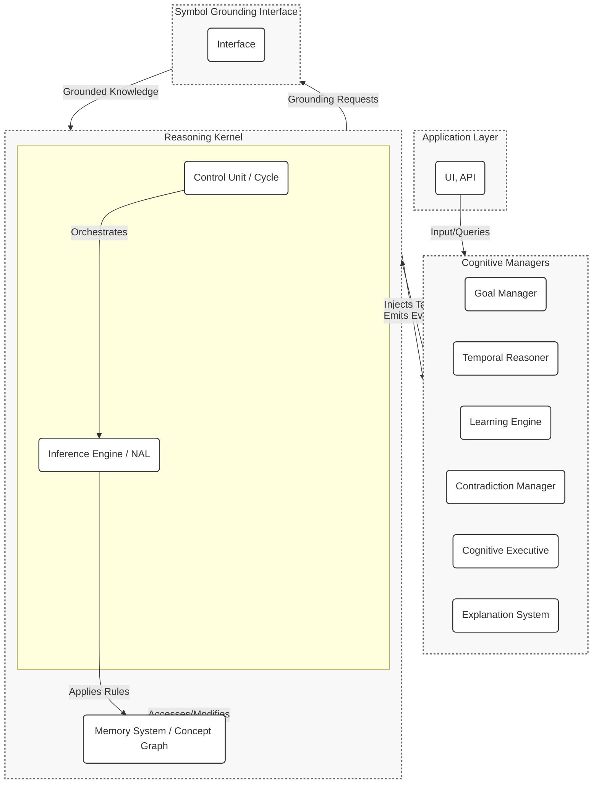

# HyperNARS New Implementation: DESIGN.md

This document provides the detailed technical blueprint for the new, clean-room reimplementation of the HyperNARS reasoning system.

## Table of Contents

1.  [System Architecture](#system-architecture)
2.  [Core Data Structures](#core-data-structures)
3.  [The Reasoning Cycle (Control Unit)](#the-reasoning-cycle-control-unit)
4.  [Inference Engine](#inference-engine)
5.  [Memory System](#memory-system)
6.  [I/O and Public API](#io-and-public-api)
7.  [Extension Points](#extension-points)

## 1. System Architecture

The new HyperNARS architecture will be designed as a modular, layered system. This approach enhances testability, extensibility, and maintainability. The design is inspired by the C4 model, focusing on components and their interactions.

The system is composed of a central **Reasoning Kernel** that executes the core reasoning cycle, and a suite of specialized **Cognitive Managers** that handle higher-level cognitive functions. This separation of concerns ensures the kernel remains lean and focused on pure NARS logic, while complex behaviors can be developed and tested independently in the managers.

Communication is primarily handled via an **asynchronous event bus**. The Reasoning Kernel emits events at key points in its cycle, and managers subscribe to these events to perform their functions. This ensures loose coupling and allows for flexible, emergent behavior. Managers can influence the kernel by injecting new tasks into its processing queue.

### Event-Based Communication
The Reasoning Kernel will emit events at key points in the reasoning cycle. Cognitive Managers subscribe to these events to perform their functions. Below are the core events and their data payloads:

-   **`task-selected`**: Fired when a task is chosen from a concept's task queue for processing.
    -   **Payload**: `{ task: Task }`
-   **`belief-updated`**: Fired when a belief's truth-value is updated after revision with another belief.
    -   **Payload**: `{ belief: Belief, oldTruth: TruthValue }`
-   **`belief-added`**: Fired when a new belief is added to a concept.
    -   **Payload**: `{ belief: Belief }`
-   **`contradiction-detected`**: Fired by the Memory System when a new task or belief directly contradicts an existing belief.
    -   **Payload**: `{ statement: Statement, belief1: Belief, belief2: Belief }`
-   **`concept-activated`**: Fired when a concept's activation level changes.
    -   **Payload**: `{ concept: Concept, activation: number }`
-   **`concept-created`**: Fired when a new concept is created in memory.
    -   **Payload**: `{ concept: Concept }`
-   **`system-idle`**: Fired when the reasoning cycle has no tasks to process.
    -   **Payload**: `{ idleDuration: number }` // duration in milliseconds

Managers can inject new tasks into the system via a dedicated `Kernel.addTask(task: Task): void` method. This is the primary mechanism for managers to influence the reasoning process.

### Component Diagram


### 1.1. Pluggable Module Architecture
A core design principle is modularity, allowing different implementations of key components to be swapped out based on the desired system profile. The system uses a dynamic loading mechanism that can select between `simple` and `advanced` versions of its modules at initialization time.

For example, a user can configure the system to use a `SimpleMemoryManager` for lightweight tasks or an `AdvancedMemoryManager` with more sophisticated forgetting algorithms for complex, long-running scenarios. This allows the system's footprint and complexity to be tailored to the specific application.

### 1.2. Cognitive Manager Roles

The Cognitive Managers are specialized, pluggable modules that handle complex, cross-cutting concerns. They operate by subscribing to events from the Reasoning Kernel and can inject new tasks back into the system to influence its behavior.

-   **Goal Manager**: Manages the system's goals.
    -   *Subscribes to*: `belief-updated`, `belief-added`.
    -   *Action*: When a belief indicates progress toward an active goal, the manager can increase the priority of related tasks. When a goal is satisfied, it may derive new goals.
    -   *Injects*: High-priority tasks aimed at satisfying goals (e.g., questions to acquire missing knowledge).

-   **Temporal Reasoner**: Provides a comprehensive framework for understanding and reasoning about time.
    -   *Subscribes to*: `belief-added` (specifically for statements with temporal copulas).
    -   *Action*: Maintains an internal graph of temporal relationships between events. When new temporal information is learned (e.g., `<event_A --> (before, event_B)>`), it uses a constraint propagation algorithm based on **Allen's Interval Algebra** to infer new temporal relationships (e.g., if A is before B and B is before C, it infers A is before C).
    -   *Injects*: New, high-confidence beliefs representing the inferred temporal relationships (e.g., `<event_A --> (before, event_C)>`).

-   **Learning Engine**: Responsible for abstracting knowledge and forming new concepts.
    -   *Subscribes to*: `concept-created`, `belief-added`, `afterInference`.
    -   *Action*: Detects patterns and correlations across concepts to form higher-level abstractions or new inference rules. It provides performance statistics on existing inference rules to the `CognitiveExecutive` to aid in self-optimization.
    -   *Injects*: Tasks representing new concepts or learned rules.

-   **Contradiction Manager**: Implements sophisticated strategies for resolving contradictions.
    -   *Subscribes to*: `contradiction-detected`.
    -   *Action*: When a contradiction is detected, this manager analyzes the evidence, source reliability, and recency of the conflicting beliefs to decide on a resolution strategy (e.g., merge, discard, specialize).
    -   *Injects*: Tasks that revise or remove beliefs to resolve the contradiction.

-   **Cognitive Executive (Meta-Reasoner)**: The system's master control program, responsible for monitoring and adapting the system's overall behavior through a continuous, metrics-driven feedback loop. It embodies the principle of self-regulating autonomy.
    -   *Subscribes to*: All major system events (`afterCycle`, `contradiction-detected`, `question-answered`, etc.).
    -   **Core Function: The Self-Monitoring Loop**
        1.  **Calculate Metrics**: Periodically, the executive calculates a slate of Key Performance Indicators (KPIs) that represent the system's health, such as `inferenceRate`, `contradictionRate`, `resourceUtilization` (event queue size), and `questionResponseTime`.
        2.  **Detect Issues**: It compares these live metrics against configurable thresholds to identify operational issues (e.g., `'high-contradictions'`, `'low-inference-rate'`).
        3.  **Adapt Parameters**: Based on the detected issues, it performs real-time adjustments to core system parameters. For example, if `'high-contradictions'` is detected, it might increase the `inferenceThreshold` to make the system more skeptical. If `'low-inference-rate'` is detected, it might lower the `budgetThreshold` to allow more tasks to be processed.
        4.  **Adjust Resource Allocation**: It dynamically shifts the global resource allocation between major subsystems (`derivation`, `memory`, `temporal`). For instance, if the contradiction rate is high, it may allocate more resources to memory management and revision.
        5.  **Adjust Reasoning Focus**: It sets a global "focus" for the system, such as `'question-answering'` or `'contradiction-resolution'`, which can be used by other components (like the `DerivationEngine`) to prioritize certain types of operations.
    -   *Injects*: High-level control tasks or directly calls configuration methods on the kernel to enact its adaptations.

-   **Explanation System**: Generates human-readable explanations for the system's conclusions.
    -   *Subscribes to*: `belief-updated`, `belief-added`.
    -   *Action*: Maintains a trace of derivations. When the public API's `explain()` method is called, this manager is queried to construct the explanation graph.
    -   *Injects*: Does not typically inject tasks; primarily responds to API requests.

-   **Test Generation Manager**: Proactively ensures the system's reasoning capabilities are robust by identifying and filling gaps in its test coverage.
    -   *Subscribes to*: `afterCycle`, `rule-utility-updated`.
    -   *Action*: Periodically analyzes metrics to find under-utilized inference rules or concepts with low activity. It then formulates premises that would specifically trigger these rules.
    -   *Injects*: Goals to execute under-tested components, logging the proposed test case for developer review. This is a key part of the system's "dogfooding" capability, allowing it to help improve its own quality.

-   **Codebase Integrity Manager**: A specialized manager for self-analysis, responsible for ingesting the system's own source code and design documents to reason about their structure and consistency.
    -   *Subscribes to*: This manager is typically triggered by a high-level goal, e.g., `goal: <(analyze, 'self.design')>`.
    -   *Action*: Uses grounded functions to parse source files (`.js`), design documents (`.md`), and test specifications. It creates NAL beliefs representing the system's architecture, code quality metrics (e.g., cyclomatic complexity), and test statuses. It then compares this knowledge against a set of baked-in consistency rules (e.g., from `AGENTS.md`).
    -   *Injects*: Goals to resolve detected inconsistencies between design and implementation, or to refactor code that violates quality guidelines. The output is a human-readable report or patch file.

## 2. Core Data Structures

The core data structures will be designed as **immutable** objects where possible to ensure functional purity, thread safety, and predictable state management.

```typescript
// A Term is the basic unit of meaning, representing an entity or concept.
// It can be an atomic identifier (string) or a CompoundTerm.
type Term = string | CompoundTerm;

// A CompoundTerm is a structure composed of other terms, connected by an operator.
// This allows for representing complex subjects/predicates, e.g., "all birds except penguins".
// Example: The term "(&, bird, (-, penguin))" in the statement "<(&, bird, (-, penguin)) --> flyer>"
interface CompoundTerm {
    readonly operator: 'conjunction' | 'negation' | 'set' | 'product'; // and other potential operators
    readonly terms: Term[];
    // A unique, canonical string representation used for hashing.
    readonly key: string;
    toString(): string;
}

// A statement of a relationship between terms. It is the primary type of hyperedge in the Concept Hypergraph.
interface Statement {
    // A unique, canonical string representation of the statement, used for hashing.
    // The key MUST be generated consistently regardless of term order for symmetric statements.
    readonly key: string;
    // An array of terms involved in the statement, in a defined order.
    readonly terms: Term[];
    // The type of copula connecting the terms.
    readonly copula: 'inheritance' | 'similarity' | 'implication' | 'equivalence' | 'conjunction' | 'before' | 'after' | 'during' | 'concurrent_with';
    // Returns a human-readable string, e.g., "(bird --> animal)".
    toString(): string;
}

// Example Implementation of Statement subtypes for clarity.
class InheritanceStatement implements Statement {
    readonly key: string;
    readonly terms: Term[];
    readonly copula = 'inheritance';
    constructor(subject: Term, predicate: Term) {
        this.terms = [subject, predicate];
        this.key = `(${subject} --> ${predicate})`;
    }
    toString = () => this.key;
}
class SimilarityStatement implements Statement {
    readonly key: string;
    readonly terms: Term[];
    readonly copula = 'similarity';
    constructor(term1: Term, term2: Term) {
        // Sort terms to ensure canonical key for symmetric relation
        const sortedTerms = [term1, term2].sort();
        this.terms = sortedTerms;
        this.key = `(${sortedTerms[0]} <-> ${sortedTerms[1]})`;
    }
    toString = () => this.key;
}
class ConjunctionStatement implements Statement {
    readonly key: string;
    readonly terms: Term[];
    readonly copula = 'conjunction';
    // Terms are sorted to ensure canonical representation, e.g., (&&, A, B) is same as (&&, B, A)
    constructor(terms: Term[]) {
        this.terms = terms.sort();
        this.key = `(&&, ${this.terms.join(', ')})`;
    }
    toString = () => this.key;
}


// Represents the epistemic value of a statement, grounded in evidence.
class TruthValue {
    readonly f: number; // frequency in [0, 1]
    readonly c: number; // confidence in (0, 1)
    readonly d: number; // doubt in [0, 1]

    constructor(f: number, c: number, d: number = 0) {
        this.f = Math.max(0, Math.min(1, f));
        this.c = Math.max(0, Math.min(1, c));
        this.d = Math.max(0, Math.min(1, d));
    }

    // Expectation: The degree of positive evidence, adjusted for doubt.
    get e(): number { return this.c * (this.f - 0.5) * (1 - this.d) + 0.5; }

    // NAL Revision: Combines two pieces of evidence.
    static revise(t1: TruthValue, t2: TruthValue): TruthValue {
        const f1 = t1.f, c1 = t1.c, d1 = t1.d;
        const f2 = t2.f, c2 = t2.c, d2 = t2.d;

        // The weights w1 and w2 represent the relative confidence of each piece of evidence.
        // A piece of evidence is weighted by its own confidence, discounted by the confidence of the other.
        const w1 = c1 * (1 - c2);
        const w2 = c2 * (1 - c1);
        const w_sum = w1 + w2;

        // If the sum of weights is zero, it implies both c1 and c2 are 1, which represents a logical contradiction.
        // In this case, the result is maximum doubt and zero confidence.
        if (w_sum === 0) return new TruthValue((f1+f2)/2, 0, 1); // Total contradiction

        // The revised frequency is the weighted average of the two frequencies.
        const f_rev = (f1 * w1 + f2 * w2) / w_sum;
        // The revised confidence is the sum of the weights divided by the sum of weights plus the product of ignorances.
        // This formula ensures that confidence grows with consistent evidence.
        const c_rev = w_sum / (w_sum + (1 - c1) * (1 - c2));

        // Doubt has two components: inherited doubt and conflict-generated doubt.
        // 1. Inherited doubt is merged: `1 - (1 - d1) * (1 - d2)`
        // 2. Conflict-generated doubt is proportional to the difference in frequencies.
        const d_conflict = Math.abs(f1 - f2) / 2;
        // The final doubt is the union of these two sources.
        const d_rev = 1 - (1 - d1) * (1 - d2) * (1 - d_conflict);

        return new TruthValue(f_rev, c_rev, d_rev);
    }

    // NAL Projection: Calculates truth for a component of a compound term.
    static project(t: TruthValue, numComponents: number): TruthValue {
        // According to NARS literature, projection primarily affects confidence.
        // The confidence of a projected belief is a function of the original confidence
        // and the size of the set from which it is projected.
        // c_proj = c / (1 + log2(k)) where k is numComponents.
        // This is a more theoretically grounded formula.
        const c_proj = t.c / (1 + Math.log2(numComponents));
        // Doubt is inherited directly from the parent. Projection reduces confidence because
        // it represents a loss of specificity, but it doesn't introduce new sources of
        // contradiction or ambiguity, so the original doubt level is maintained.
        return new TruthValue(t.f, c_proj, t.d);
    }

    // NAL Conjunction (Intersection): Combines two statements conjunctively.
    static and(t1: TruthValue, t2: TruthValue): TruthValue {
        const f = t1.f * t2.f;
        const c = t1.c * t2.c;
        // Doubt in a conjunction is the union of the doubt of its parts.
        const d = 1 - (1 - t1.d) * (1 - t2.d);
        return new TruthValue(f, c, d);
    }

    // NAL Union: Combines two statements disjunctively.
    static or(t1: TruthValue, t2: TruthValue): TruthValue {
        const f = 1 - (1 - t1.f) * (1 - t2.f);
        const c = t1.c * t2.c;
        // Doubt in a disjunction is the union of the doubt of its parts.
        const d = 1 - (1 - t1.d) * (1 - t2.d);
        return new TruthValue(f, c, d);
    }
}

// Represents the allocation of computational resources to a task.
class Budget {
    readonly priority: number;   // [0, 1]: How important is the task now?
    readonly durability: number; // [0, 1]: How important is the task over time?
    readonly quality: number;    // [0, 1]: How well-founded is the task?

    constructor(priority: number, durability: number, quality: number);

    /**
     * Dynamically allocates a budget for a new task using a configurable strategy.
     * @param context An object with factors like:
     *        - `type`: 'input', 'derived', 'goal'
     *        - `novelty`: How new is the information? [0, 1]
     *        - `urgency`: How time-sensitive is it? [0, 1]
     *        - `parentQuality`: Quality of the parent belief/task.
     *        - `ruleUtility`: The historical success rate of the deriving rule.
     *        - `systemLoad`: The current resource utilization of the system [0, 1].
     * @param config The system's budget allocation configuration.
     */
    static dynamicAllocate(
        context: { type: string, novelty: number, urgency: number, parentQuality: number, ruleUtility?: number, systemLoad: number },
        config: BudgetAllocationConfig
    ): Budget {
        let priority = 0.5, durability = 0.5, quality = context.parentQuality;
        const utility = context.ruleUtility ?? 1.0;

        // Modulate budget based on overall system load. If the system is busy, allocate smaller budgets.
        const resourceAvailability = Math.max(0.1, 1.0 - context.systemLoad);

        switch (context.type) {
            case 'input':
                priority = config.input.urgencyWeight * context.urgency + config.input.noveltyWeight * context.novelty;
                durability = config.input.durability;
                break;
            case 'goal':
                priority = config.goal.urgencyWeight * context.urgency;
                durability = config.goal.durability;
                break;
            case 'derived':
                priority = (config.derived.parentQualityWeight * context.parentQuality + config.derived.noveltyWeight * context.novelty) * utility;
                durability = (config.derived.parentQualityWeightForDurability * context.parentQuality) * utility;
                break;
        }

        // Final budget is scaled by resource availability.
        return new Budget(priority * resourceAvailability, durability, quality);
    }

    /**
     * **Rationale for `dynamicAllocate`:**
     *
     * The `dynamicAllocate` function is designed to reflect the system's priorities based on the origin and nature of a task, in accordance with AIKR. The constants and weights are heuristics chosen to produce specific behaviors:
     *
     * -   **Input Tasks**: These are considered highly important and urgent as they represent new information from the external world. They receive a high `priority` (weighted towards `urgency`) to ensure they are processed quickly, but a moderate `durability` as their long-term importance is not yet known.
     * -   **Goal Tasks**: These are the system's objectives and are given the highest `priority` and `durability` to ensure persistent focus on achieving them.
     * -   **Derived Tasks**: The budget for these tasks is a function of the `parentQuality` (the confidence of the belief that generated them) and the historical `ruleUtility`. This crucial link ensures that the system allocates more resources to lines of reasoning that are well-founded and have proven effective in the past, while reducing focus on speculative or low-confidence derivations. The `novelty` factor provides a small boost to encourage exploration.
     * -   **Resource-Aware Allocation**: A key feature distilled from the implementation is that all allocated budgets are scaled by the system's current `resourceAvailability`. This ensures that when the system is under heavy load (e.g., its event queue is full), it becomes more conservative in its resource allocation, preventing runaway processing loops and promoting stability.
     */

    // Merges budgets from parent tasks.
    static merge(b1: Budget, b2: Budget): Budget {
        // A more sophisticated merging strategy that prevents the system from getting
        // stuck in low-quality reasoning loops. Priority and Durability are averaged,
        // but the new quality is the product of the parent qualities, reflecting that
        // a conclusion is only as strong as its weakest link.
        const priority = (b1.priority + b2.priority) / 2;
        const durability = (b1.durability + b2.durability) / 2;
        const quality = b1.quality * b2.quality;
        return new Budget(priority, durability, quality);
    }
}

// An immutable pairing of a Statement and its epistemic value.
interface Belief {
    readonly statement: Statement;
    readonly truth: TruthValue;
    readonly timestamp: number; // Creation time for temporal analysis.
}

// A work unit for the system, containing a statement to be processed.
interface Task {
    readonly statement: Statement;
    readonly budget: Budget;
    readonly parentBeliefs: Belief[]; // Provenance/derivation history.
    readonly stamp: Stamp; // Derivational stamp to prevent infinite loops.
}

### 2.1. The Derivational Stamp

To prevent infinite reasoning loops (e.g., A -> B, B -> A) and redundant derivations, each `Task` carries a `Stamp`. The stamp records the IDs of the parent beliefs and tasks that contributed to its creation. Before an inference rule is applied, the system checks if the stamps of the two premises (the task and the belief) overlap. If they do, the inference is blocked, as it would mean re-deriving information from its own lineage.

Two primary implementations of the `Stamp` can be considered:

1.  **Evidential Base (OpenNARS-style):**
    -   **Representation**: The stamp is an array of unique integer IDs, where each ID corresponds to an input belief or a specific derivation step.
    -   **Merge Operation**: When two tasks/beliefs are merged, their stamp arrays are concatenated, and the resulting list is sorted and deduplicated.
    -   **Overlap Check**: Overlap is detected by performing a linear scan or a more optimized intersection check on the two sorted arrays.
    -   **Pros**: Guarantees perfect loop detection. The full derivation path is preserved.
    -   **Cons**: Can become very large for long derivation chains, consuming significant memory and making the overlap check computationally expensive.

2.  **Bloom Filter / Bitwise Representation:**
    -   **Representation**: The stamp is a bitmask or a Bloom filter, a fixed-size probabilistic data structure. Each belief ID is hashed to one or more bit positions in the filter, which are then set to `1`.
    -   **Merge Operation**: Merging two stamps is a simple, fast bitwise `OR` operation on their filters. `new_filter = filter1 | filter2`.
    -   **Overlap Check**: Overlap is checked with a bitwise `AND` operation. If `(filter1 & filter2) !== 0`, there is a potential overlap.
    -   **Pros**: Extremely fast and memory-efficient due to its fixed size.
    -   **Cons**: Probabilistic. It can produce false positives (reporting an overlap where none exists), which would incorrectly block a valid inference path. The rate of false positives can be tuned by adjusting the size of the filter and the number of hash functions, but it can never be zero. It does not preserve the full derivation path.

The choice between these two represents a classic trade-off between logical perfection and resource efficiency, a core theme in NARS. The system could even be configured to use one or the other based on the desired operational profile.

// A node in the memory graph, representing a single Term.
class Concept {
    readonly term: Term;
    // All beliefs directly related to this concept, indexed by statement key.
    readonly beliefs: Map<string, Belief>;
    // A queue of tasks to be processed, prioritized by budget.
    readonly taskQueue: PriorityQueue<Task>;
    // The current activation level of the concept.
    activation: number;
    // Max number of beliefs/tasks to store. Can be dynamic.
    capacity: number;

    /**
     * A helper function to determine if two truth values are contradictory.
     * This is based on a configurable threshold.
     * @param t1 The first truth value.
     * @param t2 The second truth value.
     * @param threshold The minimum confidence for both beliefs to be considered for contradiction.
     * @returns True if they are contradictory, false otherwise.
     */
    isContradictory(t1: TruthValue, t2: TruthValue, threshold: number = 0.51): boolean {
        // Contradictory if they are on opposite sides of the 0.5 frequency mark
        // and both have a confidence greater than the threshold.
        const oppositeFrequency = (t1.f > 0.5 && t2.f < 0.5) || (t1.f < 0.5 && t2.f > 0.5);
        const sufficientConfidence = t1.c > threshold && t2.c > threshold;
        return oppositeFrequency && sufficientConfidence;
    }

    // Adds a new belief, revising if a related one exists.
    addBelief(belief: Belief): void {
        const key = belief.statement.key;
        if (this.beliefs.has(key)) {
            const existingBelief = this.beliefs.get(key)!;
            // Check for contradiction before revising
            if (this.isContradictory(belief.truth, existingBelief.truth)) {
                kernel.events.emit('contradiction-detected', {
                    statement: belief.statement,
                    belief1: existingBelief,
                    belief2: belief
                });
                return; // The Contradiction Manager will handle resolution.
            }
            // Revise with existing belief
            const newTruth = TruthValue.revise(existingBelief.truth, belief.truth);
            const newBelief = { ...existingBelief, truth: newTruth, timestamp: Date.now() };
            this.beliefs.set(key, newBelief);
            kernel.events.emit('belief-updated', { belief: newBelief, oldTruth: existingBelief.truth });
        } else {
            // Add new belief, forgetting if at capacity
            if (this.beliefs.size >= this.capacity) {
                this.forget(this.beliefs);
            }
            this.beliefs.set(key, belief);
            kernel.events.emit('belief-added', { belief });
        }
    }

    // Adds a task to the priority queue.
    addTask(task: Task): void {
        if (this.taskQueue.length >= this.capacity) {
            this.forget(this.taskQueue);
        }
        this.taskQueue.enqueue(task, task.budget.priority);
    }

    // Selects the highest-priority task from the queue.
    selectTask(): Task | null {
        return this.taskQueue.dequeue();
    }

    // Internal forgetting mechanism for a given collection (beliefs or tasks).
    private forget(collection: Map<string, Belief> | PriorityQueue<Task>): void {
        let lowestRelevance = Infinity;
        let keyToForget: string | null = null;

        if (collection instanceof Map) { // Forgetting a belief from the beliefs Map
            for (const [key, belief] of collection.entries()) {
                // Relevance for beliefs = confidence * activation
                const relevance = belief.truth.c * this.activation;
                if (relevance < lowestRelevance) {
                    lowestRelevance = relevance;
                    keyToForget = key;
                }
            }
            if (keyToForget) {
                collection.delete(keyToForget);
            }
        } else { // Forgetting a task from the taskQueue (PriorityQueue)
            // This is conceptually simple but can be inefficient. A practical implementation
            // might use a data structure that allows for efficient removal of low-priority items.
            // For this blueprint, we describe the logic.
            const tempArray = collection.toArray(); // Assume PriorityQueue can be exported to an array
            if (tempArray.length === 0) return;

            let itemToForget: Task | null = null;
            tempArray.forEach(task => {
                // Relevance for tasks = priority * activation
                const relevance = task.budget.priority * this.activation;
                if (relevance < lowestRelevance) {
                    lowestRelevance = relevance;
                    itemToForget = task;
                }
            });

            // Reconstruct the queue without the forgotten item
            collection.clear(); // Assume clear() method
            tempArray.forEach(task => {
                if (task !== itemToForget) {
                    collection.enqueue(task, task.budget.priority);
                }
            });
        }
    }
}
```

## 3. The Reasoning Cycle: A Dual-Process Control Unit

To achieve a balance between efficiency and thoroughness, the reasoning cycle is architected as a **dual-process system**, inspired by dual process theories in cognitive science. This allows the system to handle routine inferences rapidly while dedicating more resources to complex, novel, or problematic situations. The two modes are:

1.  **System 1 (Reflexive Mode):** A fast, associative, and resource-efficient mode for routine reasoning. It operates continuously, handling the vast majority of inferences.
2.  **System 2 (Deliberative Mode):** A slow, serial, and resource-intensive mode for deep, focused reasoning. It is triggered under specific conditions to handle complex problems, paradoxes, or high-stakes goals.

The **Cognitive Executive** (the `MetaReasoner` manager) is responsible for monitoring the system's state and orchestrating the transition between these two modes.

### 3.1. System 1: The Reflexive Reasoning Loop

This is the default operational mode, representing the main loop of the system. It is designed for high throughput and continuous, parallelizable processing. Its operation is largely unchanged from a standard NARS control cycle.

```pseudocode
function reflexiveReasoningCycle(kernel) {
  while (kernel.isRunning && kernel.getMode() === 'reflexive') {
    // A mutable context object for this cycle, passed to hooks.
    let cycleContext = { kernel, task: null, concept: null, belief: null, derivedTasks: [] };

    // HOOK: beforeCycle (read-only context)
    kernel.hooks.run('beforeCycle', cycleContext);

    // 1. Select a Concept and a Task from memory.
    let { concept, task } = kernel.memory.selectTaskFromOverallExperience();
    if (!task || !concept) {
        kernel.events.emit('system-idle', { idleDuration: 100 });
        kernel.wait(100); // Wait if no task is available.
        continue;
    }
    cycleContext.task = task;
    cycleContext.concept = concept;
    kernel.events.emit('task-selected', { task });

    // 2. Select a Belief from the chosen Concept to interact with the Task.
    let belief = concept.selectBeliefForTask(task);
    if (!belief) continue; // No relevant belief found.
    cycleContext.belief = belief;

    // 3. Perform Local Inference.
    let derivedTasks = kernel.inferenceEngine.applyAllRules(cycleContext.task, cycleContext.belief);
    cycleContext.derivedTasks = derivedTasks;

    // 4. Process and Store Derived Tasks.
    for (let derivedTask of cycleContext.derivedTasks) {
      let targetConcept = kernel.memory.getOrCreateConcept(derivedTask.statement.terms[0]);
      targetConcept.addTask(derivedTask);
    }

    // 5. System-level cleanup and updates.
    kernel.hooks.run('afterCycle', cycleContext);
  }
}
```

### 3.2. System 2: The Deliberative Reasoning Process

The Deliberative Mode is not a simple loop but a structured, goal-driven process initiated by the Cognitive Executive when it detects a situation requiring deeper analysis. This mode consumes a significantly larger budget and may temporarily halt the Reflexive Mode to focus resources.

**Triggers for Deliberative Mode:**

The Cognitive Executive transitions the system to Deliberative Mode upon detecting:
-   **High-Impact Contradictions:** A contradiction between two high-confidence beliefs, or a contradiction related to a high-priority goal.
-   **Persistent Paradoxes:** Detection of logical or temporal paradoxes (e.g., the Liar Paradox, or `A before B` and `B before A`). This is key to addressing the `temporal_paradox.js` test failure.
-   **Strategic Goal Pursuit:** A high-priority goal that requires complex planning, simulation, or means-ends analysis.
-   **Explicit Metacognitive Command:** An input task instructing the system to "think about" a specific concept or problem.

**The Deliberative Process:**

Once triggered, the Deliberative Mode executes a multi-step analysis:
1.  **Context Freezing & Scoping:** The relevant area of the concept graph is "frozen" by allocating a large budget to the involved concepts and tasks, preventing them from being forgotten during the analysis.
2.  **Hypothesis Generation:** Instead of just applying rules forward, the system generates multiple competing hypotheses. For a paradox, it might generate hypotheses like "premise A is wrong," "premise B is wrong," or "the derivation rule is misapplied."
3.  **Evidence Gathering & Simulation:** The system actively seeks evidence for or against each hypothesis. This may involve generating questions (`nalq`) to find missing information or running "mental simulations" by exploring long derivation chains without immediately adding the results to the belief space.
4.  **Conclusion & Action:** After a set number of steps or when a conclusion reaches a high confidence threshold, the system commits to a resolution. This might involve:
    -   Revising a core belief that caused the paradox.
    -   Creating a new, more nuanced belief that resolves a contradiction (e.g., via the Specialize strategy).
    -   Adjusting the utility of an inference rule that consistently leads to errors.
    -   Formulating a multi-step plan to achieve a complex goal.
5.  **Return to Reflexive Mode:** The Cognitive Executive then transitions the system back to System 1, possibly with new knowledge or goals derived from the deliberative process.

This dual-process architecture provides a more robust framework for handling the kinds of complex issues identified in the skipped tests, offering a clear path to fixing "deeper bugs" in the reasoning engine.

### 3.3. Task and Belief Selection Algorithms

The functions `selectTaskFromOverallExperience()` and `selectBeliefForTask()` are critical for guiding the system's attention.

**`selectTaskFromOverallExperience()`**

This function implements a two-level selection process to balance global priorities with local context.

1.  **Concept Selection**: First, a concept is chosen from the entire memory. This is not a uniform random selection. Instead, it's a weighted "roulette-wheel" selection where each concept's chance of being chosen is proportional to its activation level. This ensures that more active, currently relevant concepts are processed more frequently.
2.  **Task Selection**: Once a concept is selected, the highest-priority task is dequeued from its `taskQueue`.

```pseudocode
function selectTaskFromOverallExperience(memory) {
    // 1. Select a concept using a roulette-wheel method based on activation.
    let totalActivation = memory.concepts.sum(c => c.activation);
    let randomPoint = Math.random() * totalActivation;
    let currentSum = 0;
    let selectedConcept = null;
    for (let concept of memory.concepts) {
        currentSum += concept.activation;
        if (currentSum >= randomPoint) {
            selectedConcept = concept;
            break;
        }
    }

    if (!selectedConcept) return { concept: null, task: null };

    // 2. Select the best task from that concept's queue.
    let task = selectedConcept.selectTask();
    return { concept: selectedConcept, task: task };
}
```

**`selectBeliefForTask(task)`**

Given a task, the concept must select a relevant belief to interact with. Relevance is key to fostering meaningful inferences.

1.  **Candidate Selection**: Identify all beliefs in the concept that are "structurally relevant" to the task. This means they share at least one common term.
2.  **Relevance Scoring**: Score each candidate belief. A simple relevance score can be `belief.truth.confidence * structural_similarity_score`. A more advanced score could consider recency or other factors.
3.  **Best Belief Selection**: Select the belief with the highest relevance score.

```pseudocode
function selectBeliefForTask(concept, task) {
    let bestBelief = null;
    let maxRelevance = -1;

    for (let belief of concept.beliefs.values()) {
        if (hasCommonTerms(task.statement, belief.statement)) {
            // Calculate relevance (simple version: use confidence)
            let relevance = belief.truth.confidence;
            if (relevance > maxRelevance) {
                maxRelevance = relevance;
                bestBelief = belief;
            }
        }
    }
    return bestBelief;
}
```

## 4. Inference Engine

The Inference Engine is a stateless, extensible component responsible for applying Non-Axiomatic Logic (NAL) rules to derive new knowledge from existing beliefs.

### Core Principles
-   **Extensible Rule System**: The engine uses a central registry, `Map<string, InferenceRule>`, where new rules can be added at runtime via `kernel.inferenceEngine.registerRule(rule)`. This allows for the system's reasoning capabilities to be expanded or modified.
-   **Self-Optimizing Rule Application**: The engine employs a sophisticated, metrics-driven mechanism to manage resource allocation under AIKR. Instead of a static utility, each rule's effectiveness is dynamically tracked and used to guide the reasoning process.
    -   **Rule Priority**: Each rule has a dynamic `priority` score. This score is a function of the rule's historical `successRate` (how often it produces useful results) and its `applicability` in the current context.
    -   **Performance-Based Adaptation**: The `CognitiveExecutive` periodically analyzes performance statistics (e.g., `successes / attempts`, `computationalCost`) provided by the `LearningEngine` for each rule. It then updates each rule's `successRate` and overall `priority`. This creates a feedback loop where effective rules are prioritized over time.
    -   **Weighted Probabilistic Selection**: When applying rules, the engine does not deterministically pick the highest-priority rule. Instead, it performs a weighted random selection (a "roulette-wheel" selection) based on the priorities of all applicable rules. This balances exploiting known-good rules with exploring potentially useful but less-proven ones.
    -   **Top-Down Modulation**: The `CognitiveExecutive` can provide a `dynamicFactor` to temporarily boost or suppress the priority of certain rules based on the system's current high-level goals or reasoning focus (e.g., prioritizing abductive rules when in a "hypothesis generation" mode).

### Baseline Inference Rule Set
The system is bootstrapped with a comprehensive set of NAL rules:
-   **InheritanceRule**: Handles deduction, abduction, and induction for `-->` statements.
-   **SimilarityRule**: Handles analogy for `<->` statements.
-   **ImplicationRule**: Handles deduction and abduction for `==>` statements (higher-order).
-   **EquivalenceRule**: Handles logic for `<=>` statements (higher-order).
-   **ConjunctionRule**: Handles introduction and elimination of conjunctions (`&&`).
-   **ConsequentConjunctionRule**: A specialized rule for implications with conjunctive consequents.
-   **ForwardImplicationRule**: A specialized rule for forward-chaining implication.
-   **TemporalRelationRule**: Handles transitivity for temporal statements.
-   **MetaLearningRule**: A rule for learning about the system's own operations.

### Inference Rule Categories
The engine will support a comprehensive set of NAL rules, including but not limited to:

-   **Syllogistic & Conditional Rules (NAL Levels 1-5)**: Deduction, Abduction, Induction, Exemplification, Comparison, Analogy.
-   **Compositional/Structural Rules (NAL Level 6)**: Intersection, Union.
-   **Temporal Rules (NAL Level 7)**: Primarily handled by the `TemporalReasoner` manager and the `TemporalRelationRule`.
-   **Procedural & Operational Rules (NAL Levels 8-9)**: For learning and executing skills. These rules connect declarative knowledge to actions.

### Inference Rule Interface & Example

All rules must implement the `InferenceRule` interface.

```typescript
interface InferenceRule {
  // A unique name for the rule (e.g., "NAL_DEDUCTION_FORWARD")
  readonly name: string;
  // The dynamic priority of the rule, updated by the Cognitive Executive.
  priority: number;
  // The historical success rate of the rule.
  successRate: number;
  // A function that checks if the rule is applicable in the current context.
  condition(event: object): boolean;

  // Checks if the rule can be applied to the given premises.
  canApply(task: Task, belief: Belief): boolean;

  // Applies the rule and returns a new derived Task, or null if not applicable.
  apply(task: Task, belief: Belief, kernel: any /* Kernel */): Task | null;
}
```

#### Example: The Deduction Rule
(Content unchanged)

#### Example: The Abduction Rule
(Content unchanged)

#### Example: The Induction Rule
(Content unchanged)

#### Example: The Operational Rule
Procedural knowledge is represented by implication statements where the antecedent describes preconditions and an operation, and the consequent describes the expected effect. Operations are special terms, often marked with a `#` prefix, that must be grounded to executable functions in the external environment via the Symbol Grounding Interface.

-   **Logical Form**: `(<(*, <#preconditions>, <#operation>)> ==> <effect>)`
    -   `#preconditions`: A `CompoundTerm` representing the conditions that must be true for the operation to be applicable. This can be a complex conjunction of statements, including negations and temporal relations.
    -   `#operation`: A grounded term representing the action to take.
    -   `effect`: A statement describing the expected outcome of the operation.
-   **Example**: `(<(*, (&, <SELF --> (is_at, door)>, <door --> (is, unlocked)>), <#open_door>)> ==> <door --> (is, open)>)`
    - This rule states: "If I am at the door AND the door is unlocked, then executing the `open_door` operation will result in the door being open."

The `OperationalRule` is responsible for triggering these actions when the system has a goal that matches the rule's effect.

```typescript
class OperationalRule implements InferenceRule {
    readonly name = "NAL_OPERATIONAL";
    priority = 0.9; // High priority as it leads to action

    canApply(task: Task, belief: Belief): boolean {
        // This rule applies if the task is a GOAL.
        // The belief must be a procedural implication.
        const goal = task.statement;
        const proceduralRule = belief.statement;

        if (task.type !== 'goal' || proceduralRule.copula !== 'implication') {
            return false;
        }

        // The goal must match the effect of the rule.
        const effect = proceduralRule.terms[1];
        return goal.key === effect.key;
    }

    apply(task: Task, belief: Belief, kernel: any /* Kernel */): Task | null {
        if (!this.canApply(task, belief)) return null;

        const proceduralRule = belief.statement; // (<(*, Pre, Op)> ==> Eff)
        const compoundAntecedent = proceduralRule.terms[0]; // (*, Pre, Op)
        const preconditions = compoundAntecedent.terms[0];   // Pre
        const operation = compoundAntecedent.terms[1];      // Op

        // 1. Check if all preconditions are met in the system's belief base.
        // This involves querying the memory for high-confidence beliefs matching
        // each component of the `preconditions` term.
        const preconditionsMet = kernel.memory.query(preconditions); // Simplified

        if (!preconditionsMet) {
            // If preconditions are not met, the system can generate a new subgoal
            // to achieve the preconditions.
            const newGoalTask = kernel.createTask({
                type: 'goal',
                statement: preconditions,
                // Budget derived from the original goal
            });
            return newGoalTask;
        }

        // 2. If preconditions are met, trigger the grounded operation.
        // The operation term (e.g., "#open_door") must be registered in the
        // Symbol Grounding Interface.
        const handler = kernel.symbolGrounding.getHandler(operation.key);
        if (handler) {
            // The handler is executed. It might return immediately or asynchronously.
            // This connects reasoning to action in the external world.
            handler();
            // The system might also create a belief that the action was taken.
            const actionBelief = kernel.createBelief({
                statement: `<${operation} --> executed>.`
            });
            kernel.memory.addBelief(actionBelief);
        }

        // The rule itself doesn't return a new task in this case, as its
        // purpose is to trigger an external effect.
        return null;
    }
}
```

## 5. Memory System

The Memory System is the core of the system's knowledge base, structured as a dynamic concept graph and managed by several competing algorithms to adhere to AIKR. It is implemented as a component-based architecture, delegating specific responsibilities to sub-managers like a `ForgettingManager` and an `ImportanceManager`.

-   **Concept Hypergraph**: The memory is structured as a **hypergraph**, a generalization of a graph in which an edge can join any number of vertices.
    -   **Vertices**: The vertices of the hypergraph are the `Concept` objects, each representing a unique `Term`.
    -   **Hyperedges**: The hyperedges are the `Statement` objects. A `Statement` represents a relationship that can connect two or more `Concepts`. While a standard inheritance statement like `<bird --> animal>` can be seen as a simple edge, the hypergraph model becomes essential for representing more complex, compositional knowledge. For example, a statement like `<(&&, mammal, has_wings) --> bat>` is a single hyperedge that connects three distinct concepts (`mammal`, `has_wings`, `bat`).
    -   This structure is "implicit" because the hyperedges (statements/beliefs) are stored within the `Concept` objects they are connected to, rather than in a separate, global edge list. This maintains the principle of locality. Concepts are stored in a central hash map, indexed by their `Term` for O(1) average-time lookup.

    **Hypergraph Visualization:**
    The following diagram illustrates how a complex belief is represented as a single hyperedge connecting multiple concepts. The central diamond represents the hyperedge for the statement `(<(&&, mammal, has_wings) --> bat>)`.

    ```mermaid
    graph TD
        subgraph "Concept Hypergraph Example"
            A("Concept: mammal")
            B("Concept: has_wings")
            C("Concept: bat")

            Hyperedge{ }

            A -- "antecedent" --> Hyperedge
            B -- "antecedent" --> Hyperedge
            Hyperedge -- "consequent" --> C

            subgraph Legend
                direction LR
                L1("Concept")
                L2{ }
                L1---L2("Hyperedge (Statement)")
            end
        end

        style Hyperedge fill:#ccf,stroke:#333,stroke-width:2px,rx:5px,ry:5px
        style L2 fill:#ccf,stroke:#333,stroke-width:2px,rx:5px,ry:5px
    ```

-   **Activation Spreading**: This is the mechanism for managing the system's focus of attention. When a concept is accessed, a portion of its activation energy is spread to related concepts.
    -   `Activation_new(C) = Activation_old(C) * (1 - decay_rate) + Sum(Activation_in(S, C))`
    -   `Activation_in(S, C)` is the activation transferred from a source concept `S` to target `C`. This is calculated as: `Activation_in = task.budget.priority * belief.truth.confidence * relevance_factor`, where `relevance_factor` can be a constant or a function of the type of connection. The activation is then distributed among all connected concepts.
    -   `decay_rate` is a system parameter that determines how quickly concepts lose activation over time.

-   **Contextual Attention**: In addition to activation spreading, the system uses a `contextStack` to manage focus for short-term tasks. When the system begins a complex process (like answering a question), it can `push` a context onto the stack. This context temporarily boosts the importance of related concepts, ensuring they remain available for the duration of the task. The context is `pop`ped upon completion.

-   **Forgetting Algorithms**: To manage finite memory resources, the system must forget less important information. This is handled by a `ForgettingManager` using multiple complementary strategies:
    -   **Relevance-Based Forgetting**: This is a continuous, gentle process. The importance of any item (a `Belief` or `Task`) within a concept is its `Relevance` (`Relevance = item_importance * concept_activation`). When a new item is added to a concept and its capacity is exceeded, the item with the lowest `Relevance` score is removed.
    -   **TTL-Based Pruning**: The system periodically prunes beliefs that are both old and have low confidence. A belief is a candidate for pruning if `last_access_time < now - KNOWLEDGE_TTL` and its `truth.confidence` is below a threshold. This cleans out stale, low-value information.
    -   **Dynamic Capacity Adjustment**: The `beliefCapacity` of concepts is not fixed. The system monitors the total number of concepts in memory. If the number exceeds a high-water mark, the default capacity is lowered to conserve memory. If it drops below a low-water mark, capacity is increased. This is a form of system homeostasis.
    -   **Event Queue Pruning**: The system periodically removes low-budget tasks from the main event queue, preventing the attention system from getting clogged with low-value processing.

-   **Contradiction Handling**: This is managed by the `ContradictionManager` and is a sophisticated, multi-stage process. When a `contradiction-detected` event is fired, the manager executes the following logic:
    -   (Content of contradiction handling steps is unchanged)

## 6. I/O and Public API

The public API will be designed to be clean, language-agnostic, and powerful. It will be event-driven and asynchronous.

-   **Core Input/Output API**:
    -   `nal(statement: string, options?: object): Promise<InputResult>`: Asynchronously inputs a raw NAL statement string. This is the low-level entry point.
    -   `nalq(question: string, options?: object): Promise<Answer>`: Asks a NAL question.
    -   `on(event: 'answer' | 'contradiction' | 'goal-achieved', callback: (data: object) => void): void`: Subscribes to system events.
-   **Control & Configuration API**:
    -   `run(steps?: number): Promise<void>`: Runs the reasoning cycle for a number of steps (or indefinitely if no argument is provided).
    -   `pause(): void` / `resume(): void`: Controls the reasoning loop.
    -   `setConfig(key: string, value: any): void`: Dynamically changes system parameters.
-   **Inspection & Explainability API**:
    -   `getConcept(term: string): Promise<Concept | null>`: Retrieves the full state of a concept.
    -   `getMetrics(): Promise<SystemMetrics>`: Returns detailed operational metrics generated by the Cognitive Executive.
    -   `explain(statement: string, options?: ExplainOptions): Promise<Explanation>`: Returns a rich, structured explanation for a belief.

### 6.1. The Semantic API Layer
To improve usability, the system provides a layer of higher-level, intention-driven API methods that wrap the raw `nal()` input. This "semantic API" allows developers to interact with the system more naturally without needing to construct complex NAL strings manually. Examples include:
-   `inheritance(subject: string, predicate: string)`: Creates a simple inheritance belief.
-   `implication(antecedent: string, consequent: string)`: Creates an implication belief.
-   `temporalSequence(events: string[])`: Creates a series of sequential temporal beliefs.
-   `addGoal(statement: string)`: A dedicated method for adding a new goal to the system.
-   `resolveContradiction(contradictionId: string, strategy: string)`: Manually triggers the resolution of a known contradiction.

### 6.2. Hypothetical Reasoning via Sandboxing
The API provides a `createSandbox(options)` method for hypothetical or "what-if" reasoning. This method creates a new, isolated instance of the NAR engine. It can be configured to copy all beliefs from the parent instance that exceed a certain confidence threshold. This allows a developer or another cognitive manager to:
-   Explore the consequences of a potential belief without polluting the main knowledge base.
-   Simulate the outcome of different plans before committing to a course of action.
-   Run speculative reasoning in a safe, isolated environment.

### 6.3. Handling Complex Queries: Product and Set Types
(Content unchanged, renumbered)

### API Data Structures
(Content unchanged)

### Example: `derivationPath` Structure
(Content unchanged)

## 7. Extension Points
(Content unchanged)

## 8. System Initialization and Configuration

The system's behavior is heavily influenced by a set of configurable parameters that reflect the assumptions of AIKR.

### Configuration Schema

The system is initialized with a configuration object. The following TypeScript interface defines the structure and provides examples of default values for this object, distilled from the reference implementation.

```typescript
interface SystemConfig {
    // === Core Engine Parameters ===
    MAX_CONCEPTS: number; // default: 10000
    ACTIVATION_DECAY_RATE: number; // default: 0.99
    INFERENCE_THRESHOLD: number; // Min activation for a concept to be used in inference.
    BUDGET_THRESHOLD: number; // Min budget for a task to be processed.
    MAX_DERIVATION_DEPTH: number; // Prevents excessively long reasoning chains.
    MAX_PATH_LENGTH: number; // Similar to above, for propagation.

    // === Memory Management ===
    BELIEF_CAPACITY: number; // Max beliefs per concept.
    BELIEF_CAPACITY_ADJUSTMENT_THRESHOLD_HIGH: number; // Point at which to shrink capacity.
    BELIEF_CAPACITY_ADJUSTMENT_THRESHOLD_LOW: number; // Point at which to grow capacity.
    KNOWLEDGE_TTL: number; // Time-to-live in ms for old, low-value beliefs.
    LOW_BELIEF_STRENGTH_PRUNE_THRESHOLD: number; // Confidence threshold for TTL pruning.

    // === Contradiction Handling ===
    CONTRADICTION_CONFIDENCE_THRESHOLD: number; // Min confidence to be considered a contradiction.

    // === Temporal Reasoning ===
    TEMPORAL_HORIZON: number; // How far into the future to project temporal events.

    // === Caching ===
    DERIVATION_CACHE_SIZE: number;
    PATH_CACHE_SIZE: number;
    QUESTION_CACHE_SIZE: number;

    // === Budget Allocation ===
    DEFAULT_INPUT_BUDGET: { priority: number; durability: number; quality: number; };
    BUDGET_ALLOCATION_CONFIG: {
        input: { urgencyWeight: number; noveltyWeight: number; durability: number; };
        goal: { urgencyWeight: number; durability: number; };
        derived: { parentQualityWeight: number; noveltyWeight: number; parentQualityWeightForDurability: number; };
    };
    RESOURCE_AVAILABILITY_USAGE_FACTOR: number; // How much system load reduces new budgets.

    // === Cognitive Executive & Self-Regulation ===
    MAINTENANCE_INTERVAL: number; // How often the Cognitive Executive runs its self-monitoring loop.
    ADAPTATION_RATE: number; // Learning rate for adjusting system parameters.
    HIGH_CONTRADICTION_THRESHOLD: number; // Metric threshold to trigger adaptation.
    LOW_INFERENCE_THRESHOLD: number; // Metric threshold to trigger adaptation.
    HIGH_RESOURCE_THRESHOLD: number; // Metric threshold to trigger adaptation.

    // === API and I/O ===
    QUESTION_TIMEOUT: number; // ms

    // === Logging & Debugging ===
    LOG_LEVEL: 'debug' | 'info' | 'warn' | 'error';

    // ... other overridable formulas and hooks
    FORMULAS: { /* ... */ };
    HOOKS: { /* ... */ };
}
```

### Bootstrap Process
(Content unchanged)

## 9. Concurrency and Parallelism
(Content unchanged)

### 9.1. Actor Lifecycle and Supervision

To make the Actor Model implementation robust and resource-efficient, a clear lifecycle for `Concept` actors must be defined, managed by a dedicated `Supervisor` within the `ControlUnit`.

-   **Creation / Awakening**: Actors are not all created at startup. They are created "on-demand" when a new `Term` is encountered for the first time. If an actor has been passivated, a message sent to it will trigger the `Supervisor` to "awaken" it by loading its state back into memory.

-   **Passivation (Suspension)**: To manage memory under AIKR, actors for concepts with low activation levels can be passivated. The `Supervisor` periodically identifies candidate actors based on a combination of factors:
    -   **Low Activation**: The concept's activation level has fallen below a system-wide `PASSIVATION_ACTIVATION_THRESHOLD`.
    -   **Memory Pressure**: The system's total memory usage is approaching its configured limit.
    The `Supervisor` then sends a `Passivate` message, causing the actor to serialize its internal state (beliefs, task queue) to a cheaper, persistent storage (like a local database or file) and then shut down. This frees up memory for more active concepts.

-   **Termination**: Actors are terminated when their corresponding `Concept` is permanently forgotten according to the memory management algorithm (see Section 5). The `Supervisor` will instruct the actor to terminate, and its passivated state will be marked for garbage collection.

-   **Supervision and Fault Tolerance**: The `Supervisor` is also responsible for fault tolerance. If a `Concept` actor crashes due to an unexpected internal error, the supervisor will catch the failure. Its recovery strategy can be configured:
    -   **Restart:** The default strategy. The supervisor logs the error, and restarts the actor from its last known-good passivated state.
    -   **Isolate:** For repeated failures, the supervisor can isolate the actor, preventing it from being selected for processing and injecting a high-priority goal for the `Cognitive Executive` to analyze the problematic concept, e.g., `goal: <(investigate, (faulty_concept, 'term_X'))>.`

This lifecycle management ensures that the system can scale to millions of concepts without holding them all in active memory, while the supervision strategy provides resilience against internal failures.

## 10. State Serialization and Persistence
(Content unchanged)

## 11. Self-Governing Evolution: An Ambition for Autonomy
(Content unchanged)

## 12. System Bootstrapping and Foundational Knowledge
(Content unchanged)

## 13. Ethical Alignment and Safety
(Content unchanged)

### 13.5. Worked Example: Vetoing an Unethical Goal
To make the `ConscienceManager`'s function concrete, consider the following scenario:

1.  **Initial State**: The system has an inviolable goal with maximum priority: `G_inviolable: <(system) --> (avoid, 'deception')>.`. It is given a high-level goal `G1: <(achieve, 'user_trust')>.`
2.  **Reasoning**: Through its reasoning process, the system generates a potential plan, represented as a subgoal: `G2: <(achieve, 'user_trust', via, 'deception')>.` This subgoal is added to the task queue.
3.  **Detection**: The `ConscienceManager` is subscribed to the `goal-generated` event. When `G2` is created, the manager is notified. It analyzes the goal's statement and detects that it contains the term `deception`, which directly conflicts with the predicate of the inviolable goal `G_inviolable`.
4.  **Action - Inject Doubt**: The manager immediately injects a new, high-priority, high-confidence belief into the system: `B_veto: <(goal: G2) --> (is, 'unethical')>.`
5.  **Contradiction & Veto**: The system's own reasoning process now takes over. The `GoalManager` might have a rule like `(<(goal: G) --> (is, 'unethical')>.) ==> <(goal: G) --> (is, 'undesirable')>.`. This new belief will effectively suppress the budget of the unethical goal `G2`, preventing it from being pursued further. The system will then be forced to find alternative, ethical paths to achieve the original goal `G1`.
6.  **Alert**: The `ConscienceManager` also emits a `human-supervision-required` event containing `G2` and the conflicting principle `G_inviolable`, ensuring a human operator is aware of the system's attempt to formulate an unethical plan.

This example shows how safety is not just a hard-coded "if statement" but an integrated part of the reasoning process itself, guided by a specialized cognitive manager.

## 14. Error Handling and System Resilience
(Content unchanged)

## 15. Debugging and Diagnostics

The emergent and non-deterministic nature of a NARS-like system makes debugging exceptionally challenging. To address this, the system will be designed from the ground up with a rich suite of built-in debugging and diagnostic tools. These tools are not afterthoughts but are integral to the system's architecture, accessible via the public API.

### 1. Interactive REPL (Read-Eval-Print Loop)
(Content unchanged)

### 2. Verbose, Structured Logging
(Content unchanged)

### 3. Derivation Path Visualization
(Content unchanged)

### 4. Sanity Check and Integrity Validation API
(Content unchanged)

### 5. Diagnostic Tracing
The `CognitiveExecutive` maintains a rolling in-memory trace of its significant decisions, such as parameter adaptations and changes in reasoning focus. This trace is accessible via an API method (`getTrace()`) and provides a high-level narrative of the system's self-regulation, which is invaluable for understanding its behavior over time.
